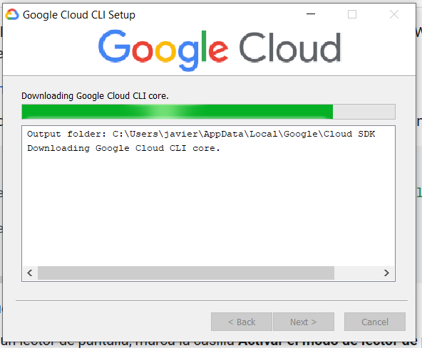
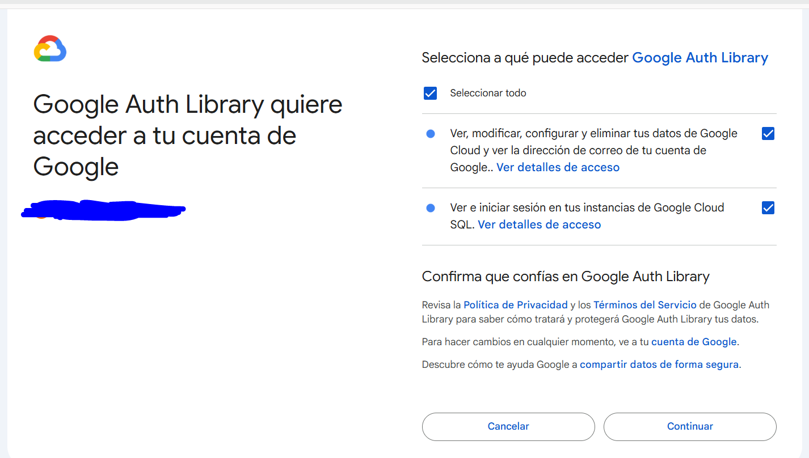
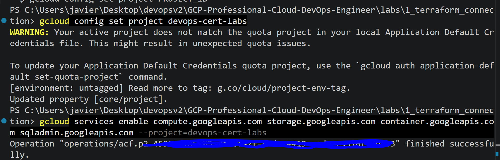
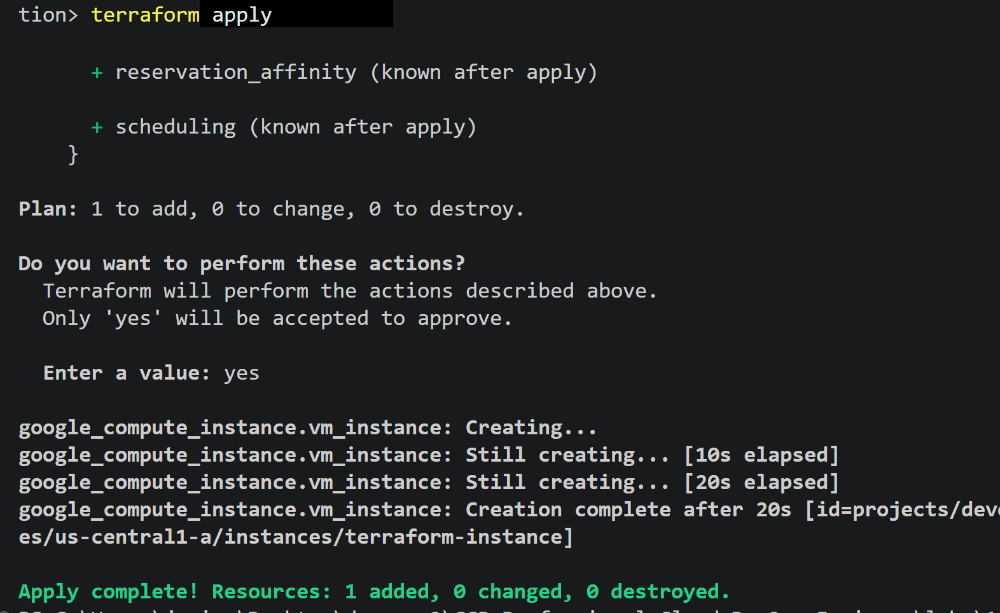
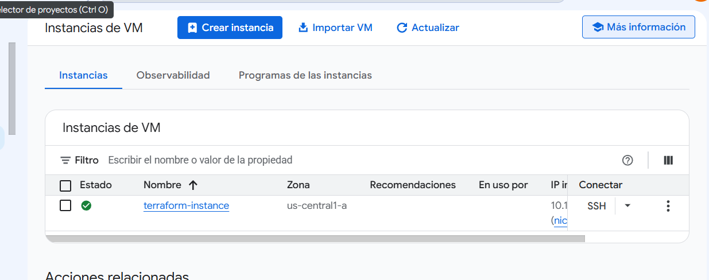

Creating project for just labs


Authenticate with gcloud (install first https://docs.cloud.google.com/sdk/docs/install-sdk?hl=es)
```
(New-Object Net.WebClient).DownloadFile("https://dl.google.com/dl/cloudsdk/channels/rapid/GoogleCloudSDKInstaller.exe", "$env:Temp\GoogleCloudSDKInstaller.exe")

& $env:Temp\GoogleCloudSDKInstaller.exe
``` 




```
gcloud auth application-default login
```



Next, create a Terraform config file named "main.tf". Inside, you'll want to include the following configuration:

```
provider "google" {
  project = "{{YOUR GCP PROJECT}}"
  region  = "us-central1"
  zone    = "us-central1-c"
}
```

The project field should be your personal project id. The project indicates the default GCP project all terraform showof your resources will be created in. Most Terraform resources will have a project field.
The region and zone are locations for your resources to be created in.
The region will be used to choose the default location for regional resources. Regional resources are spread across several zones.
The zone will be used to choose the default location for zonal resources. Zonal resources exist in a single zone. All zones are a part of a region.

Lets create a test debian instance
```
data "google_project" "project-name" {
  project_id = "devops-cert-labs"
}

resource "google_compute_instance" "vm_instance" {
  project                 = data.google_project.project-name.project_id
  name         = "terraform-instance"
  machine_type = "e2-micro"

  boot_disk {
    initialize_params {
      image = "debian-cloud/debian-11"
    }
  }

  network_interface {
    # A default network is created for all GCP projects
    network = "default"
    access_config {
    }
  }
}
```

then to test it, but first enable all the apis to dont have problems in the labs (you should not bring access to all apis, here only for educational purposes)

```
gcloud config set project devops-cert-labs

gcloud services enable compute.googleapis.com storage.googleapis.com container.googleapis.com sqladmin.googleapis.com --project=devops-cert-labs
```



```
terrafrom init
terraform apply
```



for see the state of the vm and settings

```
terraform state show google_compute_instance.vm_instance
```

for see it in gcp console (not commands)



finally destroy the resource 

```
terraform destroy -auto-approve
```

is convenient to destroy when the labs finish for reduce costs