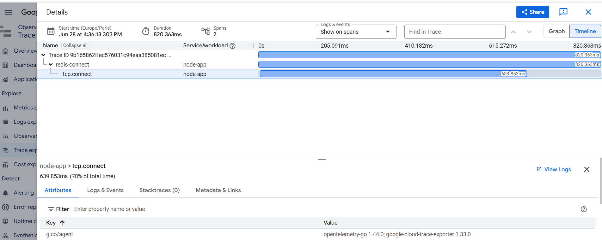

When running a Node.js application on GKE that communicates with other services over HTTP, the main challenge is not only collecting logs. The real goal is understanding which dependency is affecting performance and identifying where latency is introduced throughout the request flow.

This is a distributed tracing problem rather than a traditional logging problem.

In Google Cloud, the observability stack is divided into three main areas:

Cloud Logging: collects application logs, errors, events, and other textual information generated by services.

Cloud Monitoring: provides metrics such as CPU usage, memory consumption, latency measurements, availability indicators, and SLO tracking.

Cloud Trace: provides distributed tracing, allowing requests to be followed across multiple services.

Cloud Trace is the key component for understanding how a request moves through a distributed system.

For example, a typical request flow could look like:

User → NGINX → Node.js application → Redis → external service

With distributed tracing, it is possible to see:

* where the request started
* which services were involved
* how long each step took
* which dependency introduced additional latency

Instead of manually investigating different services individually, tracing provides a complete view of the request execution path through a waterfall-style timeline.

The purpose of option B (“Instrument all applications with Stackdriver Trace and review inter-service HTTP requests”) is to introduce visibility across all services involved in a request.

This requires:

* Instrumenting applications and services
* Generating spans for incoming and outgoing requests
* Correlating individual spans into a single trace
* Reviewing the complete request journey across services

This is the approach provided by OpenTelemetry combined with Cloud Trace.

OpenTelemetry acts as the instrumentation layer that creates and exports telemetry data.

The general flow is:

Application → OpenTelemetry SDK → OTLP exporter → OpenTelemetry Collector → Observability backend

The OpenTelemetry SDK generates spans automatically for supported operations.

The exporter sends the collected trace information using the OTLP protocol.

The OpenTelemetry Collector receives, processes, and forwards telemetry data.

In a production environment, the final destination would typically be Cloud Trace, where traces can be analyzed and correlated with other observability data.

Option D (“Modify the Node.js application to log HTTP request and response times to dependent applications and use Stackdriver Logging to find dependent applications that are performing poorly”) follows a different approach.

Instead of generating distributed traces, it relies on manually creating logs.

The process would be:

* Measure the start and end time of HTTP requests
* Write log entries containing timing information
* Search logs later to identify slow dependencies

For example:

“Request to service A took 300ms”

“Redis operation took 120ms”

Although this can provide useful information, it has important limitations:

* It requires manual implementation
* Data from different services is not automatically connected
* It does not provide a complete request lifecycle
* It is difficult to understand the relationship between multiple services

Cloud Logging provides individual events, but it does not automatically create a complete story of a request moving through multiple services.

The main difference is:

Logging:
Individual events generated by each service.

Tracing:
A complete end-to-end representation of a request across the entire system.

Example:

User → NGINX → Node.js → Redis → external API

With logging:

* Each service produces its own log entries
* The relationship between those logs must be manually determined
* The complete execution path is not visible automatically

With tracing:

* All operations belong to a single trace
* Every service interaction is visible
* Latency can be measured per step
* Performance bottlenecks can be identified immediately

This is why distributed tracing is the correct approach for identifying which dependent applications may cause performance problems.

The objective is not simply to collect more information. The objective is to understand the complete behavior of a request across a distributed architecture.

Summary:

Stackdriver Trace = Cloud Trace = distributed tracing across services

Stackdriver Logging = Cloud Logging = centralized collection of logs and events

OpenTelemetry = instrumentation framework used to generate traces and telemetry data

GKE observability with OpenTelemetry = end-to-end visibility of request flows between services

For distributed applications, tracing provides the context required to understand performance issues, while logging alone only provides isolated information from individual components.

NOTE 1:
Node is running `npm install` every time the pod restarts. That’s fine for a lab environment, but for a real GKE setup, you should create a Dockerfile and bake the dependencies into the image. That’s the professional way to deploy Node on Kubernetes.

| Command                                               | Purpose                               |
| ----------------------------------------------------- | ------------------------------------- |
| `gcloud components install gke-gcloud-auth-plugin`    | Installs GKE authentication plugin.   |
| `gcloud container clusters get-credentials ...`       | Connects kubectl to the GKE cluster.  |
| `kubectl get namespaces`                              | Lists Kubernetes namespaces.          |
| `kubectl get all -n production`                       | Shows all resources in the namespace. |
| `kubectl describe pod -n production <pod>`            | Shows pod details and events.         |
| `kubectl logs -n production deploy/node-app`          | Shows Node.js application logs.       |
| `kubectl logs -n production deploy/otel-collector -f` | Streams OpenTelemetry Collector logs. |
| `kubectl exec ...`                                    | Executes commands inside a container. |
| `kubectl get endpoints -n production node`            | Checks Service → Pod connections.     |
| `kubectl delete namespace production`                 | Deletes the whole test environment.   |

example of logs

[log](./otel.log)

SYMPLiFIED

gcloud projects describe devops-cert-labs --format="value(projectNumber)"

gcloud projects add-iam-policy-binding devops-cert-labs `
  --member="serviceAccount:PROJECT_NUMBER-compute@developer.gserviceaccount.com" `
  --role="roles/cloudtrace.agent"

https://console.cloud.google.com/traces/list?project=devops-cert-labs

