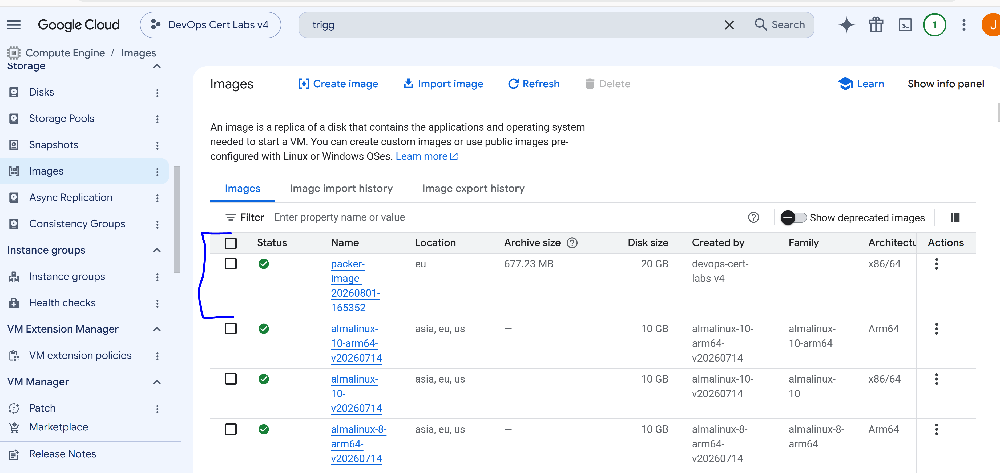

# Q105 - Build Custom Compute Engine Images with Cloud Build and Packer

## Overview

This lab demonstrates how to use **Cloud Build** together with **Packer** to automatically create a custom **Compute Engine image**.

This solution is commonly used in CI/CD pipelines when applications are deployed as virtual machines instead of containers. It is also a good choice for multi-cloud environments because Packer supports multiple cloud providers with the same configuration.

## Why Cloud Build and Packer?

Cloud Build is responsible for running the build pipeline.

Packer is responsible for creating the virtual machine image.

In this lab, Cloud Build executes the Packer commands, while Packer creates a temporary virtual machine, builds a new image, and stores it in Google Cloud.

This is why the correct solution for the certification question is **Cloud Build with Packer**.

## Architecture

```
Git Push
    │
    ▼
Cloud Build Trigger
    │
    ▼
Cloud Build
    │
    ▼
Packer
    │
    ▼
Temporary Compute Engine VM
    │
    ▼
Custom Compute Engine Image
```

## Deployment Process

When a commit is pushed to the GitHub repository, Cloud Build starts automatically.

The pipeline performs the following steps:

1. Initializes Packer.
2. Validates the Packer configuration.
3. Creates a temporary Compute Engine virtual machine.
4. Uses a public Debian 12 image as the base image.
5. Connects to the VM through SSH.
6. Creates a new Compute Engine image.
7. Deletes the temporary virtual machine.
8. Deletes the temporary disk.
9. Stores the final image inside the Google Cloud project.

## Cloud Build Pipeline

The Cloud Build pipeline runs three Packer commands:

* `packer init`
* `packer validate`
* `packer build`

The build logs show each stage of the process, including the creation of the temporary VM, the SSH connection, the image creation, and the cleanup of all temporary resources.

## Build Result

After the build finishes successfully, a new Compute Engine image is available in the project.

Example:

```
packer-image-20260801-165352
```



The image can now be used as the operating system when creating new Compute Engine virtual machines.

Instead of creating a VM directly from Debian 12, it is possible to create a VM from this custom image.

## Why Use Packer?

In this lab, the generated image is almost identical to the original Debian image because no additional configuration was applied.

However, Packer is normally used to install software and configure the operating system before creating the final image.

For example, Packer could automatically:

* Install Docker
* Install Nginx
* Install monitoring agents
* Configure firewall rules
* Create users
* Copy application files
* Configure services

As a result, every virtual machine created from the image is already configured and ready to use.

## Multi-Cloud Advantage

One of the biggest advantages of Packer is that the same template can generate images for different cloud providers.

For example:

* Google Cloud Compute Engine images
* AWS AMIs
* Azure Managed Images

Only the image source configuration changes, while the build process remains the same.

This makes Packer an excellent tool for companies that deploy virtual machines across multiple cloud providers.
