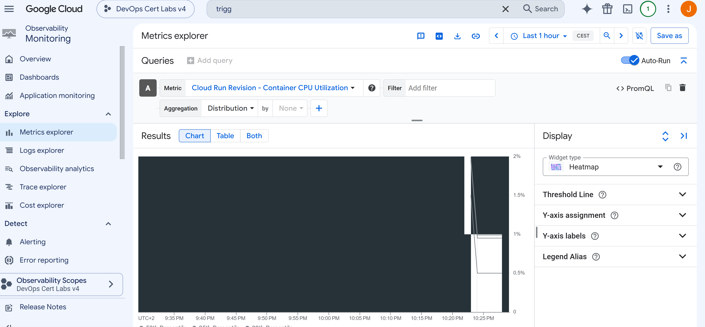

COMMANDS
```
for ($i = 1; $i -le 200; $i++) {
    curl.exe "https://cost-optimization-demo-5jykidtqgq-ew.a.run.app"
}
```



# Q108 - Monitoring Cloud Run Resource Utilization

## Scenario

A serverless application is deployed on Cloud Run. The goal is to identify CPU and memory utilization to optimize resource usage and reduce costs.

The correct answer is **Cloud Monitoring**.

## Why Cloud Monitoring?

Cloud Run is a fully managed serverless service. Google automatically collects metrics about the application without requiring any additional software.

Cloud Monitoring provides built-in metrics such as:

* Container CPU utilization
* Container memory utilization
* Request count
* Request latency
* Instance count

These metrics help determine whether the application is using too many resources or if it can be configured with lower CPU or memory limits to reduce costs.

## Why the Other Options Are Incorrect

### Cloud Trace

Cloud Trace is designed to analyze request latency and the flow of requests between services. It helps identify slow operations or downstream dependencies, but it does not focus on CPU or memory utilization.

### Cloud Profiler with Ops Agent

Cloud Profiler analyzes CPU and memory usage inside an application, but the option is incorrect because it requires the **Ops Agent**.

Cloud Run is a serverless platform, so there are no virtual machines to manage and no operating system where an agent can be installed.

### Logs-Based Metrics

Logs-based metrics are created from application logs. They are useful for monitoring custom events or application behavior, but they are not the correct tool for monitoring CPU and memory utilization because Cloud Monitoring already provides these metrics automatically.

## Lab Implementation

The lab deploys a simple Cloud Run service using Terraform.

After the deployment, requests are sent to the application to generate traffic.

For example, in PowerShell:

```powershell
for ($i = 1; $i -le 200; $i++) {
    Invoke-WebRequest "https://YOUR_CLOUD_RUN_URL" | Out-Null
}
```

After generating traffic, Cloud Monitoring displays CPU utilization, memory utilization, request count, and other metrics for the Cloud Run service.

## Deployment Issue

During the lab, Terraform returned the following error:

```text
Cloud Run Admin API has not been used in this project before or it is disabled.
```

Although the Terraform configuration enabled the Cloud Run API, Google Cloud sometimes needs a few minutes to activate a newly enabled service.

Terraform attempted to create the Cloud Run service before the API activation had fully propagated.

## Solution

The Cloud Run service should explicitly depend on the required APIs by using the `depends_on` argument.

Example:

```hcl
depends_on = [
  google_project_service.run,
  google_project_service.artifactregistry
]
```

This ensures that Terraform waits until the required APIs are enabled before creating the Cloud Run service.

If the error still appears, wait a few minutes and run `terraform apply` again. This delay is normal when enabling an API for the first time in a Google Cloud project.

## Conclusion

This lab demonstrates that Cloud Monitoring is the correct tool for monitoring resource utilization in Cloud Run. Since Cloud Run is a fully managed serverless platform, CPU and memory metrics are collected automatically, making Cloud Monitoring the best solution for performance analysis and cost optimization.
