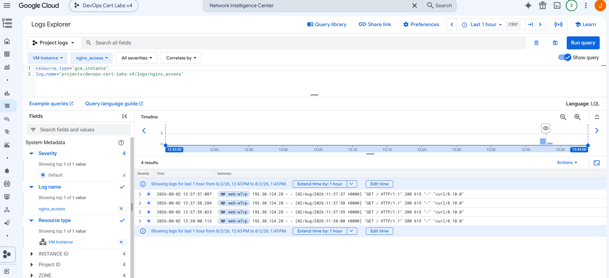

COMMANDS
```
gcloud compute instances list
curl.exe EXTERNAL_IP
```




# Q112 - Monitor Requests from a Specific IP Address

## Scenario

A web application is deployed on a Compute Engine Managed Instance Group (MIG).

The Google Cloud Ops Agent is already installed on every virtual machine.

The security team notices suspicious activity coming from one specific client IP address.

The objective is to monitor how many requests are coming from that IP address while keeping the operational effort as low as possible.

The correct answer is:

**A. Configure the Ops Agent with a logging receiver and create a logs-based metric.**

---

# Why This Is the Correct Solution

The client IP address is stored inside the web server access logs.

For example, an Nginx access log contains entries similar to:

```text
203.0.113.45 - - [02/Aug/2026:13:45:12 +0000] "GET / HTTP/1.1" 200
```

The Ops Agent can collect these log files and send them to Cloud Logging.

Once the logs are stored in Cloud Logging, a **logs-based metric** can be created.

The metric counts only the log entries where the client IP matches the suspicious address.

For example:

```text
203.0.113.45
```

This solution requires no application changes and no custom scripts.

It uses existing Google Cloud services with very little operational overhead.

---

# Why the Other Answers Are Incorrect

## B. Create a Custom Script

A script could read the log files and send custom metrics to Cloud Monitoring.

Although it works, someone must develop, deploy, monitor, and maintain the script.

This creates unnecessary operational overhead.

---

## C. Modify the Application

The application could export custom metrics directly.

However, changing production code is unnecessary because the required information already exists inside the access logs.

---

## D. Configure an Ops Agent Metrics Receiver

A metrics receiver collects system and application metrics such as CPU usage, memory usage, or Prometheus metrics.

It does not automatically analyze web server access logs to count requests from a specific client IP.

---

# Lab Architecture

The laboratory uses a Managed Instance Group running Nginx.

The Ops Agent collects the access logs and sends them to Cloud Logging.

A logs-based metric is then created from those logs.

```text
                 Internet
                     │
                     ▼
          Managed Instance Group
         +-----------------------+
         |       Nginx VM        |
         |       Nginx VM        |
         +-----------------------+
                     │
                     ▼
             Nginx Access Logs
                     │
                     ▼
        Google Cloud Ops Agent
          (Logging Receiver)
                     │
                     ▼
             Cloud Logging
                     │
                     ▼
          Logs-Based Metric
                     │
                     ▼
           Cloud Monitoring
```

---

# Lab Implementation

The infrastructure creates:

* A Compute Engine Managed Instance Group
* Nginx installed on every instance
* Google Cloud Ops Agent installed
* A logging receiver configured to collect:

```text
/var/log/nginx/access.log
```

After deployment, HTTP requests are generated using `curl`.

Each request creates a new access log entry.

The Ops Agent forwards the log entries to Cloud Logging.

---

# Creating the Logs-Based Metric

After the logs appear in Cloud Logging:

1. Open **Cloud Logging**.
2. Open **Logs Explorer**.
3. Verify that the Nginx access logs are arriving.
4. Create a new **Logs-Based Metric**.
5. Filter only the requests from the suspicious IP address.

For example:

```text
203.0.113.45
```

The metric increases every time a request from that IP address is received.

Finally, open **Cloud Monitoring** and visualize the metric.

---

# Key Lesson

Client IP addresses are stored inside web server access logs, not inside standard monitoring metrics.

When the required information already exists in logs, the simplest solution is:

* Collect the logs with the Ops Agent.
* Store them in Cloud Logging.
* Create a logs-based metric.
* Visualize the metric in Cloud Monitoring.

This approach minimizes operational overhead because no application changes or custom scripts are required while still providing accurate monitoring of requests from a specific IP address.
