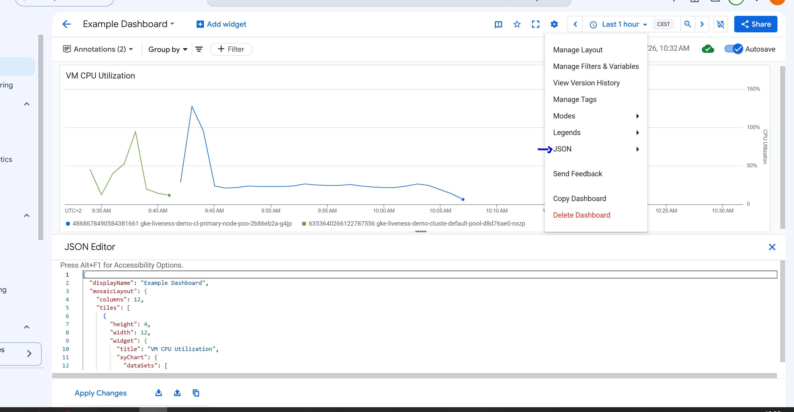

# Q120 - Share a Cloud Monitoring Dashboard

```text
   ____ _  ________
  / __ \ |/ /____  |
 / / / /   /    / /
/ /_/ /   |    / /
\___\_/_/|_|   /_/

Google Professional Cloud DevOps Engineer
Lab Q120
```

## Overview

This lab demonstrates how to share a custom Cloud Monitoring dashboard with another team.

Google Cloud Monitoring allows dashboards to be exported as a JSON file. The receiving team can import the JSON file into their own project, making it easy to reuse the same dashboard configuration.

This is the recommended method for sharing custom dashboards.

---

## Architecture

```text
+---------------------+          Export JSON          +----------------------+
|  Cloud Monitoring   | ---------------------------> |   Partner Team       |
|     Dashboard       |                              |  Import Dashboard    |
+---------------------+                              +----------------------+
```

---

## Steps

1. Open **Google Cloud Console**.
2. Go to **Monitoring**.
3. Open **Dashboards**.
4. Select the dashboard you want to share.
5. Export the dashboard as a **JSON** file.
6. Send the JSON file to the partner team.
7. The partner team imports the JSON file into Cloud Monitoring.

---

## Why Use JSON?

Exporting the dashboard as JSON preserves the complete dashboard configuration, including:

- Layout
- Charts
- Widgets
- Monitoring queries
- Visualization settings

This allows another team to recreate the same dashboard with minimal effort.

---

## Conclusion

Cloud Monitoring dashboards can be easily shared by exporting their JSON definition.

This approach is Google's recommended practice because it preserves the full dashboard configuration and allows other teams to import and reuse the dashboard in their own Google Cloud projects.