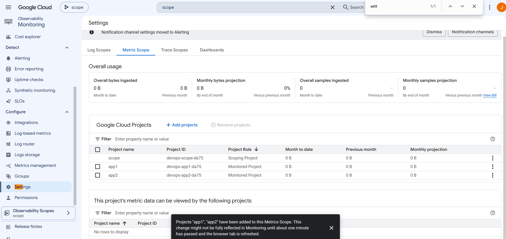

COMMANDS
```
gcloud billing accounts list
#get ba id
terraform apply -auto-approve
gcloud services enable monitoring.googleapis.com 
--project=devops-scope-da75
```



# Q122 - Cloud Monitoring Metrics Scope

## Goal

This lab reproduces the concept behind the following certification question.

> You want Cloud Monitoring dashboards to display metrics only from a specific group of projects. The dashboards must not show metrics from projects belonging to other groups.

The correct answer is:

**B. Create new scoping projects for each folder.**

Since a personal Google Cloud account does not provide an Organization or Folders, this lab reproduces the same idea using multiple projects.

---

## Architecture

```
                    +----------------------+
                    |  Scoping Project     |
                    |  devops-scope-XXXX   |
                    +----------+-----------+
                               |
                +--------------+--------------+
                |                             |
                |                             |
      +---------v---------+         +---------v---------+
      | devops-app1-XXXX  |         | devops-app2-XXXX  |
      | Monitored Project |         | Monitored Project |
      +-------------------+         +-------------------+
```

The scoping project does not run workloads.

Its purpose is to collect metrics from the monitored projects.

---

## Why this reproduces the exam question

The original question uses folders.

```
Organization
│
├── Folder A
│   ├── Project A1
│   └── Project A2
│
└── Folder B
    ├── Project B1
    └── Project B2
```

Without an Organization, folders cannot be created.

Instead, this lab creates one scoping project and two monitored projects.

```
Scoping Project
│
├── Application Project 1
└── Application Project 2
```

The concept is exactly the same.

The Metrics Scope only displays metrics from the monitored projects that belong to that scope.

---

## Terraform

Terraform creates:

- One scoping project
- Two monitored projects
- Cloud Monitoring API enabled

Each project receives a unique Project ID by using a random suffix to avoid conflicts with previously deleted projects.

Example:

```
devops-scope-856f
devops-app1-856f
devops-app2-856f
```

---

## Manual configuration

After Terraform finishes:

1. Open the scoping project.
2. Open Cloud Monitoring.
3. Open the Metrics Scope configuration.
4. Add both application projects as monitored projects.

Result:

```
Metrics Scope

+--------------------------------------+

Projects inside this scope

    devops-scope-856f
    devops-app1-856f
    devops-app2-856f

+--------------------------------------+
```

---

## What happens

Cloud Monitoring aggregates metrics from every monitored project.

```
Application 1 Metrics
           \
            \
             +--------------------+
             |   Metrics Scope    |
             |     Dashboard      |
             +--------------------+
            /
           /
Application 2 Metrics
```

The dashboard now displays metrics from both monitored projects.

Projects that are not added to the Metrics Scope are not visible.

---

## Exam concept

A Metrics Scope defines which Google Cloud projects are visible from Cloud Monitoring.

If different groups of projects must remain isolated, each group should have its own scoping project.

Example:

```
Scope A
│
├── Project A1
└── Project A2


Scope B
│
├── Project B1
└── Project B2
```

This is why the correct answer is:

**B. Create new scoping projects for each folder.**

Each folder has its own Metrics Scope, preventing dashboards from displaying metrics from projects in other folders.
```