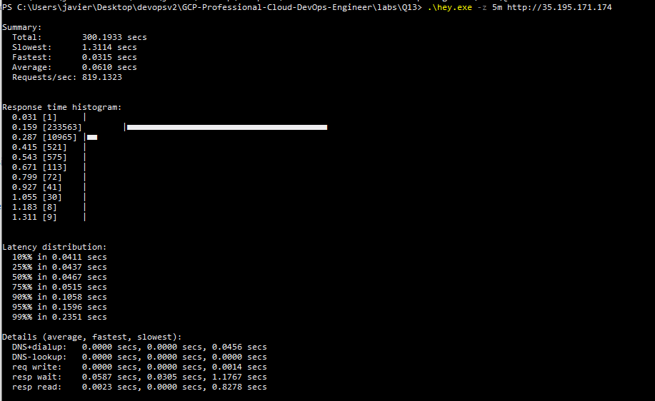

Google recommends testing your scaling strategy instead of guessing future capacity needs. Configure the Horizontal Pod Autoscaler (HPA) to scale Pods based on CPU usage, verify that the Cluster Autoscaler can add nodes when required, and perform a load test to validate the infrastructure. This ensures the application can handle future growth and zone failures while avoiding unnecessary costs from overprovisioning.

download stall hey.exe

https://storage.googleapis.com/hey-releases/hey_windows_amd64

rename it to hey.exe (in Q13)

stress test with hey.exe

NAME           REFERENCE             TARGETS       MINPODS   MAXPODS   REPLICAS   AGE
homepage-hpa   Deployment/homepage   cpu: 0%/70%   1         10        1          18m
homepage-hpa   Deployment/homepage   cpu: 0%/70%   1         10        1          19m
homepage-hpa   Deployment/homepage   cpu: 223%/70%   1         10        1          19m
homepage-hpa   Deployment/homepage   cpu: 223%/70%   1         10        4          19m
homepage-hpa   Deployment/homepage   cpu: 382%/70%   1         10        4          19m
homepage-hpa   Deployment/homepage   cpu: 382%/70%   1         10        5          20m
homepage-hpa   Deployment/homepage   cpu: 98%/70%    1         10        5          20m
homepage-hpa   Deployment/homepage   cpu: 98%/70%    1         10        6          20m
homepage-hpa   Deployment/homepage   cpu: 135%/70%   1         10        6          20m
homepage-hpa   Deployment/homepage   cpu: 135%/70%   1         10        8          20m
homepage-hpa   Deployment/homepage   cpu: 108%/70%   1         10        8          21m
homepage-hpa   Deployment/homepage   cpu: 55%/70%    1         10        8          21m
homepage-hpa   Deployment/homepage   cpu: 64%/70%    1         10        8          21m
homepage-hpa   Deployment/homepage   cpu: 58%/70%    1         10        8          22m
homepage-hpa   Deployment/homepage   cpu: 67%/70%    1         10        8          22m
homepage-hpa   Deployment/homepage   cpu: 69%/70%    1         10        8          22m
homepage-hpa   Deployment/homepage   cpu: 74%/70%    1         10        8          23m
homepage-hpa   Deployment/homepage   cpu: 61%/70%    1         10        8          23m
homepage-hpa   Deployment/homepage   cpu: 69%/70%    1         10        8          23m
homepage-hpa   Deployment/homepage   cpu: 60%/70%    1         10        8          24m
homepage-hpa   Deployment/homepage   cpu: 29%/70%    1         10        8          24m
homepage-hpa   Deployment/homepage   cpu: 0%/70%     1         10        8          24m
homepage-hpa   Deployment/homepage   cpu: 0%/70%     1         10        8          29m
homepage-hpa   Deployment/homepage   cpu: 0%/70%     1         10        7          29m
homepage-hpa   Deployment/homepage   cpu: 0%/70%     1         10        1          30m

.\hey.exe -z 5m http://35.195.171.174



# Google Cloud Professional Cloud DevOps Engineer Lab

# Question - Capacity Planning with GKE Autoscaling

---

## Introduction

This repository contains a small hands-on lab created while preparing for the **Google Cloud Professional Cloud DevOps Engineer** certification.

The goal of this lab is to understand how Google recommends planning capacity for future growth while keeping infrastructure costs under control.

Instead of manually adding resources based on estimations, Google encourages engineers to validate their infrastructure using **Horizontal Pod Autoscaler (HPA)**, **Cluster Autoscaler**, and **load testing**.

In this lab, we deploy a simple application to a **Google Kubernetes Engine (GKE) Standard regional cluster**, configure autoscaling, and simulate increased traffic using a stress test.

---

# Exam Question

> You are performing a semi-annual capacity planning exercise for your flagship service.
>
> You expect a service user growth rate of **10% month-over-month** over the next six months.
>
> Your service is fully containerized and runs on **Google Kubernetes Engine (GKE) Standard** using a **regional cluster** with **Cluster Autoscaler enabled**.
>
> You currently consume about **30% of your total deployed CPU capacity**, and you require resilience against the failure of a zone.
>
> You want to ensure that your users experience minimal negative impact as a result of this growth while avoiding unnecessary costs.
>
> **How should you prepare to handle the predicted growth?**

### A ✅

Verify the maximum node pool size, enable a Horizontal Pod Autoscaler, and perform a load test to verify your expected resource needs.

### B

Because you are deployed on GKE and are using a Cluster Autoscaler, your cluster will scale automatically regardless of growth rate.

### C

Because you are currently using only 30% of your CPU capacity, you already have enough headroom and do not need additional planning.

### D

Proactively add 60% more node capacity for the next six months, and then perform a load test.

---

# Why is A correct?

The key part of the question is:

> **"...while avoiding unnecessary costs."**

Google does not recommend provisioning large amounts of infrastructure based only on predictions.

Instead, engineers should verify that autoscaling has been configured correctly and validate the infrastructure using a realistic load test.

This approach consists of three important steps:

* Verify that the **Cluster Autoscaler** can increase the node pool when necessary.
* Configure a **Horizontal Pod Autoscaler (HPA)** so the application can automatically increase the number of Pods as demand grows.
* Perform a **load test** to confirm that the application and infrastructure can handle the expected traffic.

During this lab, increasing the traffic with **hey** caused the HPA to automatically scale the Deployment from **1 Pod to 8 Pods**.

When the stress test finished, CPU utilization returned to normal and the HPA gradually reduced the Deployment back to **1 Pod**.

This demonstrates Google's recommended capacity planning strategy: validate scaling behavior before additional capacity is actually required.

---

# Why are the other answers incorrect?

### B - The Cluster Autoscaler will scale automatically

This answer is incomplete.

The Cluster Autoscaler only adds new nodes when Kubernetes cannot schedule additional Pods due to insufficient resources.

It does **not** scale the application itself.

Without a **Horizontal Pod Autoscaler**, the number of Pods remains unchanged regardless of incoming traffic.

---

### C - 30% utilization is enough

Current utilization does not guarantee future capacity.

The service is expected to grow by **10% every month** and must also remain available if an entire zone becomes unavailable.

Capacity planning should always be validated through testing rather than assumptions.

---

### D - Add 60% more capacity immediately

This approach increases infrastructure costs unnecessarily.

One of Google's core cloud principles is to **scale on demand** instead of provisioning resources far in advance.

Autoscaling combined with load testing provides a much more efficient solution.

---

# Lab Workflow

```

Normal Traffic

│

▼

1 Replica Running

│

▼

Stress Test (hey)

│

▼

CPU Utilization Increases

│

▼

Horizontal Pod Autoscaler

│

▼

1 → 2 → 4 → 8 Pods

│

▼

Traffic Ends

│

▼

CPU Returns to Normal

│

▼

8 → 4 → 2 → 1 Pod

```

---

# Lab Architecture

The infrastructure deployed by Terraform includes:

* GKE Standard Regional Cluster
* Regional Node Pool
* Cluster Autoscaler
* Kubernetes Namespace
* Application Deployment
* LoadBalancer Service
* Horizontal Pod Autoscaler (HPA)

The stress test was generated using **hey**, sending HTTP requests to the public LoadBalancer IP.

---

# What was validated?

During the stress test, the following behavior was observed:

* CPU utilization increased.
* The Horizontal Pod Autoscaler created additional Pods.
* The Deployment scaled automatically from **1** to **8 replicas**.
* After the load test finished, the Deployment automatically scaled back down to **1 replica**.

This confirms that the autoscaling configuration behaves as expected under increased load.

---

# Google Cloud Services Used

* Google Kubernetes Engine (GKE)
* Cluster Autoscaler
* Horizontal Pod Autoscaler
* Kubernetes Service (LoadBalancer)
* Terraform

---

# Concepts Practiced

* Capacity Planning
* Horizontal Pod Autoscaling
* Cluster Autoscaling
* Load Testing
* High Availability
* Cost Optimization
* Kubernetes Resource Requests
* Google SRE Best Practices

---

# What I Learned

After completing this lab, I better understand why the correct answer is **A**.

Capacity planning is not simply about adding more infrastructure.

Google recommends validating the application's scaling behavior through realistic load testing while ensuring that both the Horizontal Pod Autoscaler and Cluster Autoscaler are correctly configured.

This approach minimizes costs while maintaining reliability as demand grows.

---

# Conclusion

This lab demonstrates one of the most important concepts tested in the Google Cloud Professional Cloud DevOps Engineer certification.

Rather than estimating future capacity and provisioning extra nodes in advance, Google recommends validating autoscaling through testing.

By combining the **Horizontal Pod Autoscaler**, **Cluster Autoscaler**, and **load testing**, engineers can confidently prepare for future growth while avoiding unnecessary infrastructure costs.

