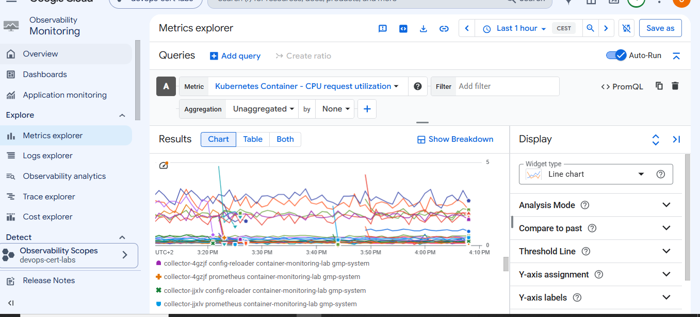

COMMANDS

```
gcloud container clusters get-credentials container-monitoring-lab `
--zone europe-west1-b `
--project devops-cert-labs

kubectl get pods -n monitoring-lab

kubectl top pods -n monitoring-lab
kubectl top pods -n monitoring-lab --containers


```



# Google Cloud Professional Cloud DevOps Engineer Lab

# Question - Identify Containers Using The Most CPU And Memory

---

## Introduction

This repository contains a hands-on laboratory created while preparing for the **Google Cloud Professional Cloud DevOps Engineer** certification.

The goal of this lab is to understand how to monitor Kubernetes workloads running on **Google Kubernetes Engine (GKE)** and identify which containers are consuming the highest amount of CPU and memory.

The exam question focuses on a common DevOps monitoring requirement:

> You support an e-commerce application that runs on a large Google Kubernetes Engine (GKE) cluster deployed on-premises and on Google Cloud Platform. The application consists of microservices that run in containers. You want to identify containers that are using the most CPU and memory. What should you do?

Options:

A. Use Stackdriver Kubernetes Engine Monitoring.

B. Use Prometheus to collect and aggregate logs per container, and then analyze the results in Grafana.

C. Use the Stackdriver Monitoring API to create custom metrics, and then organize your containers using groups.

D. Use Stackdriver Logging to export application logs to BigQuery, aggregate logs per container, and then analyze CPU and memory consumption.

---

# Correct Answer

## A - Use Stackdriver Kubernetes Engine Monitoring.

---

# Why?

The correct answer is **A** because **Stackdriver Kubernetes Engine Monitoring** (now part of **Google Cloud Monitoring**) provides native monitoring capabilities for Kubernetes resources running on GKE.

The requirement is:

> Identify containers that are using the most CPU and memory.

CPU and memory consumption are **metrics**, not logs.

GKE automatically exposes Kubernetes resource metrics such as:

- Container CPU usage.
- Container memory usage.
- Pod resource consumption.
- Node utilization.

Cloud Monitoring collects these metrics and allows operators to visualize them through dashboards.

The monitoring flow is:

```
                 GKE Cluster

                      |
                      |
                      v

              Kubernetes Containers

                      |
                      |
                      v

           CPU and Memory Metrics

                      |
                      |
                      v

              Cloud Monitoring

                      |
                      |
                      v

        Identify Highest Resource Usage
```

No additional monitoring platform is required.

---

# Why The Other Answers Are Incorrect?

---

## B - Use Prometheus to collect and aggregate logs per container, and then analyze the results in Grafana.

This option is incorrect.

Prometheus and Grafana are popular monitoring tools in Kubernetes environments, but they are not required for this scenario.

Also, Prometheus does not collect logs.

Prometheus collects metrics:

```
Prometheus

    |
    +-- CPU metrics
    |
    +-- Memory metrics
    |
    +-- Application metrics
```

Logs are handled by different systems:

```
Cloud Logging

Loki

ELK Stack
```

Since GKE already provides Kubernetes monitoring through Cloud Monitoring, introducing Prometheus adds unnecessary complexity.

---

## C - Use the Stackdriver Monitoring API to create custom metrics, and then organize your containers using groups.

This option is incorrect.

Custom metrics are useful when applications expose their own business metrics.

Examples:

```
Orders processed

Payments completed

Transactions per second
```

However, CPU and memory metrics already exist in GKE.

Creating custom metrics would duplicate information that Cloud Monitoring already provides.

Example:

```
Existing metrics:

container CPU usage

container memory usage


No need:

custom CPU metric

custom memory metric
```

---

## D - Use Stackdriver Logging to export application logs to BigQuery, aggregate logs per container, and then analyze CPU and memory consumption.

This option is incorrect.

Cloud Logging is designed for collecting and analyzing logs.

Examples:

```
Application errors

HTTP requests

Audit logs

Exceptions
```

CPU and memory consumption are not logs.

They are infrastructure metrics.

The workflow proposed by this answer would be:

```
Container

    |
    |
    v

Logs

    |
    |
    v

BigQuery

    |
    |
    v

Analysis
```

This is inefficient because GKE already provides these metrics through Cloud Monitoring.

---

# Lab Objective

This laboratory creates a small GKE environment that simulates a production Kubernetes workload.

The goal is to generate resource consumption and verify how operators can identify containers with high CPU and memory usage.

The laboratory creates:

- A GKE cluster.
- A Kubernetes namespace.
- A CPU consuming workload.
- A memory consuming workload.
- Kubernetes resource metrics.

The final architecture:

```
                  GKE Cluster

                       |
          +------------+------------+
          |                         |
          v                         v

    CPU Consumer              Memory Consumer

          |                         |
          |                         |
          v                         v

 Container CPU Metrics    Container Memory Metrics

          |
          |
          v

     Cloud Monitoring Dashboard
```

---

# Technologies Used

## Google Kubernetes Engine (GKE)

GKE provides the Kubernetes environment where the containers run.

The cluster contains workloads that simulate real applications.

Example:

```
GKE Cluster

    |
    |
    v

monitoring-lab namespace

    |
    +-- CPU container

    |
    +-- Memory container
```

---

## Cloud Monitoring (Stackdriver Kubernetes Engine Monitoring)

Cloud Monitoring provides native visibility into Kubernetes workloads.

It collects:

- Container CPU usage.
- Container memory usage.
- Pod metrics.
- Node metrics.
- Kubernetes workload health.

The architecture:

```
Kubernetes Workloads

        |

        v

GKE Monitoring

        |

        v

Cloud Monitoring

        |

        v

Dashboards and Alerts
```

---

# Infrastructure Created With Terraform

Terraform creates the complete laboratory automatically.

Resources created:

```
Google Cloud

    |
    |
    +-- GKE Cluster

    |
    |
    +-- Node Pool


Kubernetes

    |
    |
    +-- Namespace

    |
    |
    +-- CPU Deployment

    |
    |
    +-- Memory Deployment
```

---

# GKE Monitoring Configuration

The cluster enables Google Cloud monitoring services:

```hcl
resource "google_container_cluster" "cluster" {

  monitoring_service = "monitoring.googleapis.com"

  logging_service = "logging.googleapis.com"

}
```

This allows GKE metrics to be exported to Cloud Monitoring.

---

# CPU Consumer Workload

The laboratory deploys a container that generates CPU activity.

Example workload:

```
while(true)

calculate random values
```

This creates CPU consumption that can be observed through Kubernetes metrics.

---

# Memory Consumer Workload

The laboratory also deploys a container that consumes memory.

The purpose is to simulate a workload with high memory usage.

Example:

```
Application Container

        |

        v

Memory Consumption

        |

        v

Cloud Monitoring Metric
```

---

# Testing The Laboratory

After deploying the infrastructure:

Connect to the GKE cluster:

```bash
gcloud container clusters get-credentials container-monitoring-lab \
--zone europe-west1-b \
--project devops-cert-labs
```

---

## Check Running Pods

```bash
kubectl get pods -n monitoring-lab
```

Example:

```
NAME                         READY   STATUS

cpu-container                1/1     Running

memory-container             1/1     Running
```

---

# Check CPU And Memory Usage

Kubernetes provides resource metrics through Metrics Server.

Execute:

```bash
kubectl top pods -n monitoring-lab
```

Example:

```
NAME                    CPU(cores)    MEMORY(bytes)

cpu-container           230m          7Mi

memory-container        2m            31Mi
```

This immediately shows which pods consume the most resources.

---

# Check Container-Level Metrics

To see individual containers:

```bash
kubectl top pods -n monitoring-lab --containers
```

Example:

```
POD                  NAME       CPU       MEMORY

cpu-container        cpu        230m      7Mi

memory-container     memory     2m        31Mi
```

This matches the exam requirement:

> Identify containers that are using the most CPU and memory.

---

# Viewing Metrics In Google Cloud Console

The same information is available through Cloud Monitoring.

Navigation:

```
Google Cloud Console

        |

        v

Monitoring

        |

        v

Dashboards

        |

        v

Kubernetes Workloads
```

From there, operators can view:

- CPU usage per container.
- Memory usage per container.
- Pod health.
- Node utilization.

---

# Production Usage

In a real production environment, this monitoring approach allows DevOps teams to:

## Detect Resource Problems

Example:

```
Container A

CPU usage:

95%

Memory:

90%
```

---

## Identify Noisy Containers

Example:

```
Microservice A

Consumes:

80% of cluster CPU
```

---

## Create Alerts

Example:

```
IF container CPU > 90%

THEN

Notify SRE Team
```

---

# Complete Monitoring Flow

The complete workflow:

```
Container Application

          |

          v

Kubernetes Metrics

          |

          v

GKE Monitoring

          |

          v

Cloud Monitoring

          |

          v

Dashboard / Alert

          |

          v

Operator Investigation
```

---

# Final Exam Explanation

The question asks how to identify containers consuming the most CPU and memory.

The best solution is:

```
Use Stackdriver Kubernetes Engine Monitoring
```

because GKE already integrates with Cloud Monitoring and provides Kubernetes resource metrics.

Prometheus, custom metrics, and log analysis are unnecessary for this requirement.

The correct DevOps approach is:

```
GKE Workloads

        |

        v

Built-in Kubernetes Metrics

        |

        v

Cloud Monitoring

        |

        v

CPU / Memory Analysis
```

---

# Correct Answer

## A - Use Stackdriver Kubernetes Engine Monitoring.