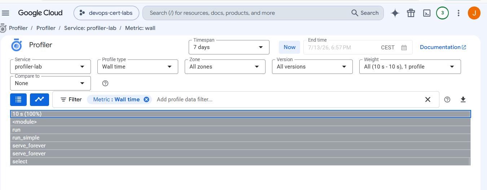
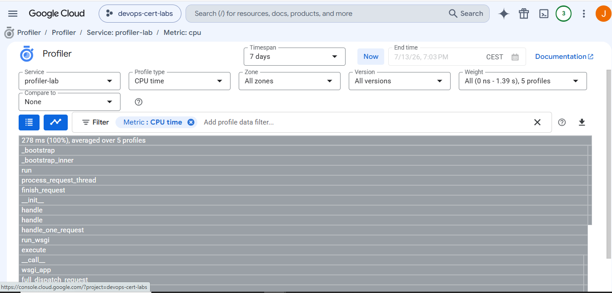

COMMANDS
```
####################################################
# Get the external IP address
####################################################

$VM_IP = terraform output -raw vm_ip

####################################################
# Verify that the VM exists
####################################################

gcloud compute instances list

####################################################
# Display the VM details
####################################################

gcloud compute instances describe profiler-lab-vm --zone=europe-west1-b

####################################################
# Test the application
####################################################

curl.exe "http://$VM_IP`:8080"

####################################################
# Open the application
####################################################

Start-Process "http://$VM_IP`:8080"

####################################################
# Open Cloud Profiler
####################################################

Start-Process "https://console.cloud.google.com/profiler?project=devops-cert-labs"

####################################################
# Open Compute Engine
####################################################

Start-Process "https://console.cloud.google.com/compute/instances?project=devops-cert-labs"

####################################################
# Open Cloud Monitoring
####################################################

Start-Process "https://console.cloud.google.com/monitoring?project=devops-cert-labs"

####################################################
# Generate CPU load for a few seconds
####################################################

1..30 | ForEach-Object {
    curl.exe -s "http://$VM_IP`:8080" > $null
}

Write-Host ""
Write-Host "========================================================="
Write-Host "Lab verification completed."
Write-Host ""
Write-Host "1. The application is running on Compute Engine."
Write-Host "2. Cloud Profiler is enabled."
Write-Host "3. Requests were generated to produce profiling data."
Write-Host "4. Open Cloud Profiler and inspect CPU usage."
Write-Host ""
Write-Host "This demonstrates why the correct answer is:"
Write-Host ""
Write-Host "B. Use Stackdriver Profiler to visualize the resource"
Write-Host "utilization throughout the application."
Write-Host "========================================================="
```





# Google Cloud Professional Cloud DevOps Engineer Lab

# Question - Finding CPU Bottlenecks with Cloud Profiler

---

## Introduction

This lab demonstrates how **Cloud Profiler** can be used to identify CPU bottlenecks inside an application running on **Google Compute Engine**.

The objective is to understand why Cloud Profiler is the correct service when developers need to analyze **where CPU time is spent** inside the application instead of only monitoring infrastructure metrics.

---

# Exam Question

A development team reports that one of their production services has become slower over time. The VM metrics show that CPU utilization is high, but the operations team cannot determine which part of the application is consuming the CPU.

Which Google Cloud service should be used?

**Correct Answer:**

> **B. Use Cloud Profiler to visualize the resource utilization throughout the application.**

---

# Why Answer B is Correct

Cloud Monitoring can show that CPU usage is high, but it **cannot identify which functions or methods are responsible** for the CPU consumption.

Cloud Profiler continuously samples the running application and collects information about where the CPU spends its time. The collected data is transformed into flame graphs and call trees, making it easy to identify performance bottlenecks.

Because profiling happens while the application is running, developers do not need to stop the service or manually instrument every function.

This makes Cloud Profiler the correct tool for analyzing CPU-intensive code in production environments.

---

# Why the Other Answers Are Incorrect

### Option A

Cloud Monitoring only reports infrastructure metrics such as CPU usage, memory usage, network traffic, and disk activity.

It tells you **that** CPU usage is high, but not **why**.

---

### Option C

Cloud Trace measures request latency and distributed request paths between services.

It is useful for understanding slow requests, but it does not show which functions consume the most CPU.

---

### Option D

Cloud Logging stores application logs and system logs.

Although logs are useful for debugging, they cannot identify CPU hotspots inside the application.

---

# Lab Architecture

The lab deploys the following resources:

- Google Compute Engine VM
- Python Flask application
- Cloud Profiler Agent
- Firewall rule allowing HTTP traffic on port 8080
- IAM permissions for Cloud Profiler

The Flask application performs an intentionally expensive CPU loop every time a request is received so Cloud Profiler has enough data to analyze.

---

# Deployment

Terraform creates the complete environment.

```bash
terraform init
terraform apply
```

---

# Verify the VM

List the Compute Engine instances.

```bash
gcloud compute instances list
```

Display the VM details.

```bash
gcloud compute instances describe profiler-lab-vm --zone=europe-west1-b
```

---

# Verify the Application

Retrieve the VM external IP.

```bash
terraform output vm_ip
```

Open the application.

```text
http://VM_EXTERNAL_IP:8080
```

The browser should display:

```
Profiler Lab Running
```

---

# Generate CPU Activity

Send multiple requests to the application.

```bash
for i in {1..100}; do
curl http://VM_EXTERNAL_IP:8080 > /dev/null
done
```

Every request executes a CPU-intensive loop, allowing Cloud Profiler to collect samples.

---

# Open Cloud Profiler

Open the Google Cloud Console.

Navigate to:

```
Operations
    → Profiler
```

or open it directly:

```
https://console.cloud.google.com/profiler
```

---

# Wait for Profiling Data

Cloud Profiler does not display results immediately.

Normally it takes several minutes before the first profile becomes available because the service must collect enough CPU samples.

Once enough data has been collected, flame graphs and call trees become available.

---

# Expected Result

Cloud Profiler should display:

- CPU profile
- Flame graph
- Call tree
- Functions consuming the most CPU
- Percentage of CPU used by each function

The `index()` function should appear as the main CPU consumer because it executes a large loop.

---

# What We Learned

In this lab we learned how to:

- Deploy a Compute Engine VM with Terraform.
- Install and configure Cloud Profiler.
- Deploy a Python Flask application.
- Generate CPU load.
- Collect profiling samples.
- Analyze CPU hotspots using Cloud Profiler.
- Understand the difference between infrastructure monitoring and application profiling.

---

# Key Takeaways

Cloud Monitoring answers:

> **"How much CPU is the VM using?"**

Cloud Profiler answers:

> **"Which function inside my application is using the CPU?"**

That difference is exactly why **Answer B** is the correct choice for the exam.

Cloud Profiler provides continuous profiling with very low overhead and helps developers identify performance bottlenecks without modifying the application logic.
