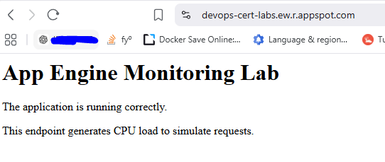

COMMANDS

```
terraform import google_app_engine_application.app devops-cert-labs
```

CAUTION, u MUST WAIT 20 MINUTES UNTIL THE APP ENGINE FLEX IS RUNNING



# Google Cloud Professional Cloud DevOps Engineer Lab

# Question - App Engine Monitoring Connections Metric

---

## Introduction

This repository contains a small hands-on lab created while preparing for the **Google Cloud Professional Cloud DevOps Engineer** certification.

The goal of this lab is to understand how to monitor an application running on **Google App Engine Flexible Environment** and identify the correct Cloud Monitoring metric to measure the number of active connections.

The original exam question asks:

> You support an application running on App Engine. The application is used globally and accessed from various device types. You want to know the number of connections. You are using Stackdriver Monitoring for App Engine. What metric should you use?

Correct answer:

**A - `flex/connections/current`**

---

# Architecture

The lab creates the following components:

```
                    Users
                      |
                      |
                      v
             App Engine Flexible
                      |
                      |
              Cloud Monitoring
                      |
                      |
             flex/connections/current
```

Infrastructure created with Terraform:

- Google App Engine application
- App Engine Flexible service
- Compute Engine instance used as deployment machine
- Python Flask application
- Cloud Monitoring metrics


---

# Why is the correct answer A?

The metric:

```
flex/connections/current
```

represents the current number of active connections handled by an **App Engine Flexible Environment** application.

This metric is the correct choice because:

- The application runs on App Engine Flex.
- The question asks about current connections.
- The metric belongs specifically to App Engine Flexible instances.


---

# Why the other options are incorrect?

## B - tcp_ssl_proxy/new_connections

```
tcp_ssl_proxy/new_connections
```

This metric belongs to **TCP SSL Proxy Load Balancing**.

It measures new connections created by the proxy, not App Engine application connections.

It is unrelated to App Engine Flex.


---

## C - tcp_ssl_proxy/open_connections

```
tcp_ssl_proxy/open_connections
```

This is also a TCP SSL Proxy metric.

It measures open connections at the load balancer proxy layer.

It does not represent connections handled by App Engine.


---

## D - flex/instance/connections/current

```
flex/instance/connections/current
```

This metric does not exist as an App Engine Flexible Monitoring metric.

The correct metric is:

```
flex/connections/current
```

without the `instance` section.

---

# Application deployed

The lab deploys a simple Flask application:

```python
from flask import Flask

app = Flask(__name__)

@app.route("/")
def home():

    total = 0

    for i in range(5000000):
        total += i

    return """
    <h1>App Engine Monitoring Lab</h1>
    <p>The application is running correctly.</p>
    <p>This endpoint generates CPU load to simulate requests.</p>
    """
```

The CPU loop generates some workload to create observable activity in Cloud Monitoring.

---

# Verification Commands

## Check App Engine services

```bash
gcloud app services list
```

Expected output:

```
SERVICE
default
```

---

## List deployed versions

```bash
gcloud app versions list
```

Example:

```
SERVICE   VERSION          TRAFFIC
default   20260713t194821  1
```

---

## Check App Engine instances

```bash
gcloud app instances list
```

Example:

```
SERVICE VERSION INSTANCE
default 20260713t194821 instance-1
```

---

## Check deployment operations

```bash
gcloud app operations list
```

This helps identify successful and failed deployments.

Example:

```
ID                                      STATUS
operation-xxxx                          COMPLETED
```

---

## Access the application

Using curl:

```bash
curl https://devops-cert-labs.ew.r.appspot.com
```

Expected response:

```html
<h1>App Engine Monitoring Lab</h1>
<p>The application is running correctly.</p>
```

---

# Cloud Monitoring Verification

Open Cloud Monitoring:

```
https://console.cloud.google.com/monitoring?project=devops-cert-labs
```

Navigate to:

```
Monitoring
    |
    └── Metrics Explorer
```

Select:

```
Resource type:
App Engine Version
```

Search for:

```
flex/connections/current
```

The chart will display the current number of active connections.

---

# Generating Traffic

To create more activity:

```bash
for i in {1..100}
do
curl https://devops-cert-labs.ew.r.appspot.com
done
```

Then check the metric again:

```
flex/connections/current
```

---

# Terraform Deployment Flow

The deployment process is:

```
terraform apply

        |
        v

Create App Engine Application

        |
        v

Create Compute Engine deployment host

        |
        v

Install Google Cloud SDK

        |
        v

Generate Flask application files

        |
        v

gcloud app deploy

        |
        v

Cloud Build

        |
        v

App Engine Flexible Version
```

---

# Troubleshooting

## Check startup script logs

Connect to the VM:

```bash
gcloud compute ssh appengine-monitoring-lab
```

Then:

```bash
sudo tail -f /var/log/initial-script.log
```

---

## Check App Engine logs

```bash
gcloud app logs tail
```

---

## Check Cloud Build history

```bash
gcloud builds list
```

---

# Exam Summary

The application runs on **App Engine Flexible Environment** and the question asks for the number of active connections.

The correct Cloud Monitoring metric is:

```
flex/connections/current
```

because it directly measures current connections for App Engine Flexible applications.

Final answer:

```
A - flex/connections/current
```