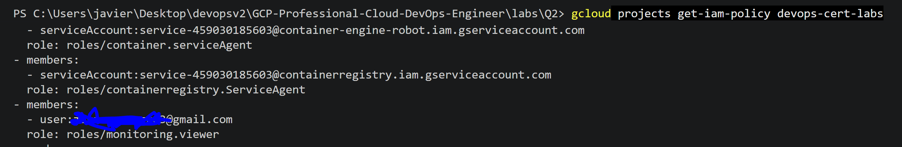
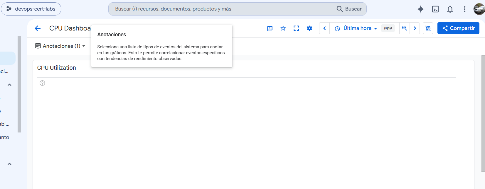
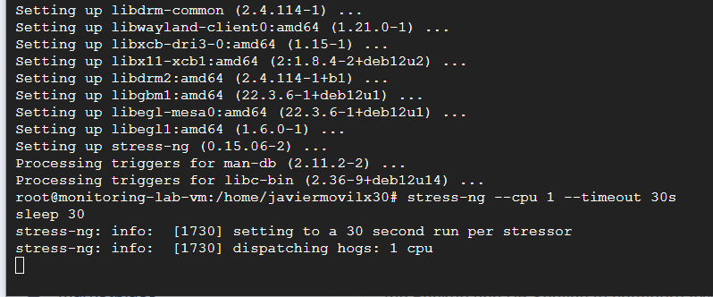
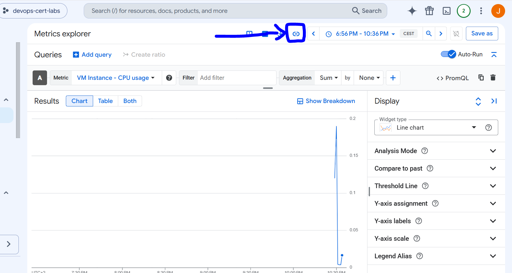
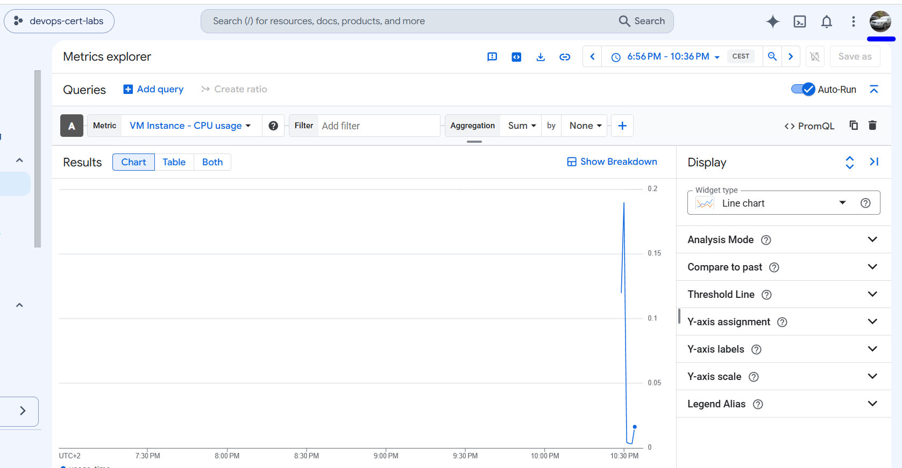

gcloud projects get-iam-policy devops-cert-labs

IMPORTANT, IF THE QUESTION REQUEST CHART, IS CHART NOT DASHBOARD, IS NOT THE SAME

stress-ng --cpu 1 --timeout 30s
sleep 30

And it should be visible for the other user with monitoring viewer role

