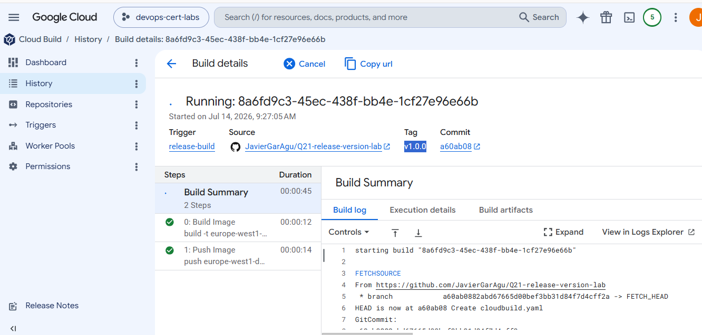
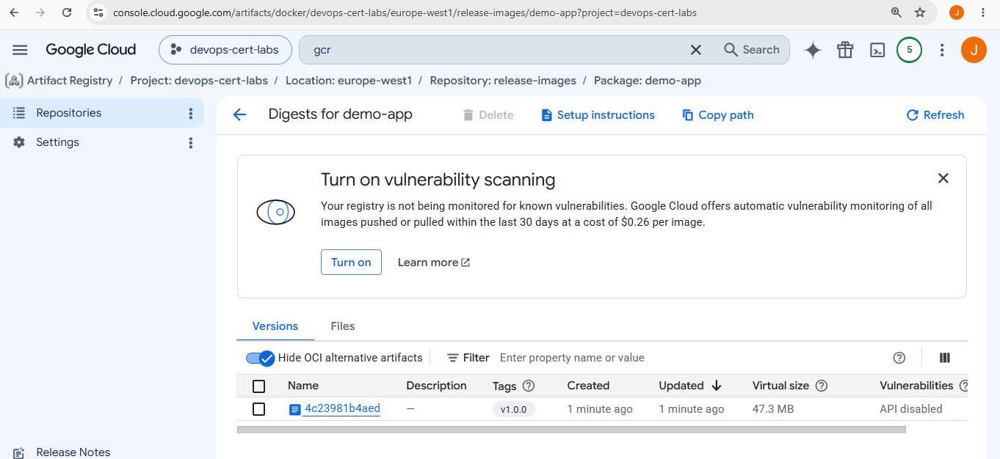

git tag -a v1.0.0 -m "Release version 1.0.0"
git push origin v1.0.0





# Google Cloud Professional Cloud DevOps Engineer Lab

# Question - Deploy a Specific Application Version Using Git Release Tags

---

## Introduction

This repository contains a hands-on lab created while preparing for the **Google Cloud Professional Cloud DevOps Engineer** certification.

The goal of this lab is to demonstrate how **Cloud Build** can automatically build and publish Docker images using the **Git release tag** as the image version. This allows deployments to reference a specific application version instead of using commit hashes or the `latest` tag.

This scenario represents a common CI/CD practice where application releases are versioned consistently between source control and the container registry.

---

## Exam Question

> Our application images are built using Cloud Build and pushed to Google Container Registry (GCR). You want to be able to specify a particular version of your application for deployment based on the release version tagged in source control. What should you do when you push the image?

- A. Reference the image digest in the source control tag.
- B. Supply the source control tag as a parameter within the image name.
- ✅ C. Use Cloud Build to include the release version tag in the application image.
- D. Use GCR digest versioning to match the image to the tag in source control.

---

# Architecture

```
GitHub Repository
        │
        │ Create Release (v1.0.0)
        ▼
Cloud Build Trigger
        │
        ▼
Docker Build
        │
        ▼
Artifact Registry

demo-app:v1.0.0
```

---

# Infrastructure

Terraform creates the following resources:

- Artifact Registry Docker repository
- Cloud Build Service Account
- IAM permissions
- Cloud Build Trigger based on Git tags

The trigger listens for Git tags matching:

```text
^v.*
```

Examples:

```text
v1.0.0
v1.1.0
v2.0.0
```

---

# Cloud Build Pipeline

The Cloud Build pipeline performs only two operations:

1. Build the Docker image.
2. Push the image to Artifact Registry.

The important part is the image tag:

```yaml
${_REGION}-docker.pkg.dev/$PROJECT_ID/${_REPOSITORY}/${_IMAGE}:$TAG_NAME
```

Instead of using:

```text
$SHORT_SHA
```

the pipeline uses:

```text
$TAG_NAME
```

Cloud Build automatically sets this variable when the build is triggered by a Git tag.

---

# Creating a Release

After pushing the project to GitHub, a release can be created by adding a Git tag.

Example:

```bash
git tag -a v1.0.0 -m "Release version 1.0.0"

git push origin v1.0.0
```

Alternatively, a release can be created directly from the GitHub Releases page.

Once the tag is pushed, Cloud Build starts automatically.

---

# Build Result

If the release tag is:

```text
v1.0.0
```

Cloud Build creates the image:

```text
demo-app:v1.0.0
```

A second release:

```text
v1.1.0
```

creates another image:

```text
demo-app:v1.1.0
```

Each application release produces a unique Docker image version.

---

# Why This Is Important

Using Git release tags provides several advantages:

- Every Docker image matches an official application release.
- Deployments can reference an exact application version.
- Rollbacks become simple because previous image versions remain available.
- Image versions are easy to understand compared to commit hashes.

This approach is widely used in production CI/CD pipelines.

---

# Why the Other Answers Are Incorrect

### A. Reference the image digest in the source control tag

Incorrect.

Image digests are generated **after** the image is built. They are not intended to be used as Git release tags.

---

### B. Supply the source control tag as a parameter within the image name

Incorrect.

The release tag should become the Docker image tag itself, not an additional parameter in the image name.

---

### D. Use GCR digest versioning to match the image to the tag in source control

Incorrect.

Container Registry stores immutable image digests, but it does not automatically associate them with Git release tags.

---

# Correct Answer

✅ **C. Use Cloud Build to include the release version tag in the application image.**

Cloud Build automatically exposes the Git release tag through the `$TAG_NAME` variable. By using this variable as the Docker image tag, every application release generates a matching container image version, making deployments predictable, traceable, and easy to roll back.

This is the recommended approach for versioning container images in a Cloud Build CI/CD pipeline.