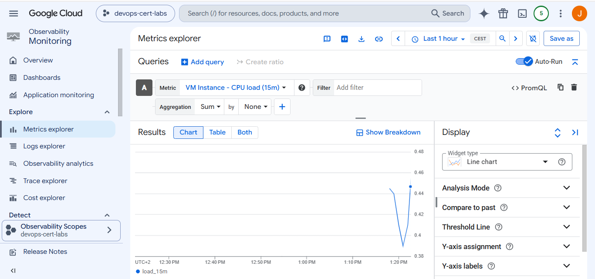

# Google Cloud Professional Cloud DevOps Engineer Lab

# Question - Monitoring Multiple Production Projects with Cloud Monitoring Workspaces

---

## Introduction

This repository contains a small hands-on lab created while preparing for the **Google Cloud Professional Cloud DevOps Engineer** certification.

The purpose of this lab is to understand how **Google Cloud Monitoring (formerly Stackdriver Monitoring)** should be organized in a production environment. The exam question focuses on monitoring multiple production projects while following the **principle of least privilege** and avoiding false alerts from development or staging environments.

Although this lab uses only one Google Cloud project, it simulates a production server that continuously sends metrics and logs to Cloud Monitoring.

---

# Architecture

```
                     Cloud Monitoring
                 (Simulated Workspace)
                          │
                          │
                          ▼
               +----------------------+
               |  Production Project  |
               | devops-cert-labs     |
               +----------------------+
                          │
                          ▼
              Google Compute Engine VM
                          │
                          ▼
                  Google Cloud Ops Agent
                          │
          ┌───────────────┴───────────────┐
          │                               │
          ▼                               ▼
   Cloud Monitoring                 Cloud Logging
```

In a real enterprise environment, the Monitoring Workspace would be located in a **separate monitoring project**, and multiple production projects would be attached to it.

---

# Files

```
.
└── main.tf
```

Everything is deployed from a single Terraform file.

---

# What Terraform Creates

The infrastructure includes:

- Google Compute Engine virtual machine
- Debian 12 operating system
- Google Cloud Ops Agent
- Cloud Monitoring API
- Cloud Logging API
- Firewall rule
- Public IP address
- Continuous CPU workload generation

---

# Infrastructure Explanation

## Provider

Terraform connects to Google Cloud.

```terraform
provider "google" {
  project = "devops-cert-labs"
  region  = "europe-west1"
  zone    = "europe-west1-b"
}
```

---

## Required APIs

Terraform enables the required Google Cloud services.

```terraform
compute.googleapis.com
monitoring.googleapis.com
logging.googleapis.com
```

These APIs are required to create virtual machines and send monitoring data.

---

## IAM Permissions

The default Compute Engine service account receives the required roles.

```terraform
roles/monitoring.metricWriter
roles/logging.logWriter
```

These permissions allow the virtual machine to send metrics and logs to Google Cloud.

---

## Compute Engine

Terraform creates one virtual machine.

```terraform
machine_type = "e2-micro"
```

The VM represents a production server running inside a production project.

---

## Startup Script

When the VM starts, Terraform automatically executes a startup script.

The script performs several tasks.

### Update the operating system

```bash
apt-get update
```

---

### Install required packages

```bash
curl
stress-ng
```

---

### Install Google Cloud Ops Agent

The startup script downloads and installs the Google Cloud Ops Agent.

```bash
bash add-google-cloud-ops-agent-repo.sh --also-install
```

The agent automatically begins sending:

- CPU metrics
- Memory metrics
- Disk metrics
- Network metrics
- System logs

to Google Cloud Monitoring and Cloud Logging.

---

### Simulate Production Load

The lab continuously generates CPU load using:

```bash
stress-ng
```

Example:

```bash
stress-ng --cpu 1 --cpu-load 70
```

This keeps CPU utilization around 70%, making the metrics easy to observe inside Cloud Monitoring.

---

# Verifying the Lab

After running:

```bash
terraform apply
```

wait approximately 2–5 minutes.

The Google Cloud Ops Agent begins sending metrics automatically.

You can verify the deployment by opening:

- Cloud Monitoring
- Metrics Explorer
- Logs Explorer

The virtual machine should appear with live metrics.

Example metrics:

- CPU Utilization
- Memory Usage
- Disk Usage
- Network Traffic

Because the lab generates continuous CPU load, the CPU graph should remain consistently active.

---

# Real Production Architecture

A production environment usually contains multiple projects.

```
                 Monitoring Project
             (Cloud Monitoring Workspace)
                        │
       ┌────────────────┼────────────────┐
       │                │                │
       ▼                ▼                ▼
 Production A     Production B     Production C
```


Each production project sends metrics to the same Monitoring Workspace.



Development and staging projects remain separated, preventing unnecessary alerts.

---

# Exam Question

You need to monitor multiple production projects.

Requirements:

- Quickly identify production incidents.
- Ignore development and staging alerts.
- Follow the principle of least privilege.

Which solution should you choose?

---

# Correct Answer

**✅ D**

> Create a new GCP monitoring project and create a Stackdriver Workspace inside it. Attach the production projects to this workspace. Grant relevant team members read access to the Stackdriver Workspace.

---

# Why Answer D Is Correct

Google recommends creating a **dedicated monitoring project** instead of using one of the production projects.

This architecture provides several advantages.

### Separation of Responsibilities

The monitoring environment is completely separated from production workloads.

---

### Better Security

Users only receive access to the Monitoring Workspace.

They do not require direct access to every production project.

This follows the **principle of least privilege**.

---

### Easier Management

A single Monitoring Workspace can collect metrics from multiple production projects.

Operations teams only need one place to monitor infrastructure.

---

### Reduced False Alerts

Development and staging projects are not attached to the production Monitoring Workspace.

Only production metrics generate alerts.

---

# Why the Other Answers Are Incorrect

## Option A

Granting read access to every production project gives users unnecessary permissions.

This violates the principle of least privilege.

---

## Option B

Project Viewer still provides access to every production project.

The monitoring team should only require access to the Monitoring Workspace.

---

## Option C

Using an existing production project as the Monitoring Workspace mixes monitoring resources with production resources.

Although this configuration works technically, Google recommends using a **dedicated monitoring project** for better isolation and easier administration.

---

# Key Concepts Learned

This lab demonstrates several important Google Cloud Monitoring concepts.

- Cloud Monitoring collects infrastructure metrics.
- Cloud Logging stores system and application logs.
- Google Cloud Ops Agent automatically sends metrics and logs.
- Monitoring Workspaces centralize observability.
- Production monitoring should be separated from development environments.
- Least privilege should always be applied when granting monitoring access.

---

# Conclusion

This lab simulates a production server that continuously reports telemetry to Google Cloud Monitoring using the Google Cloud Ops Agent.

While the lab uses a single Google Cloud project, it demonstrates the architecture behind Cloud Monitoring Workspaces and explains why Google recommends using a **dedicated monitoring project** connected to all production projects.

For the Professional Cloud DevOps Engineer exam, the most important lesson is that production monitoring should be centralized, isolated from development environments, and accessible through a dedicated Monitoring Workspace that follows the principle of least privilege.