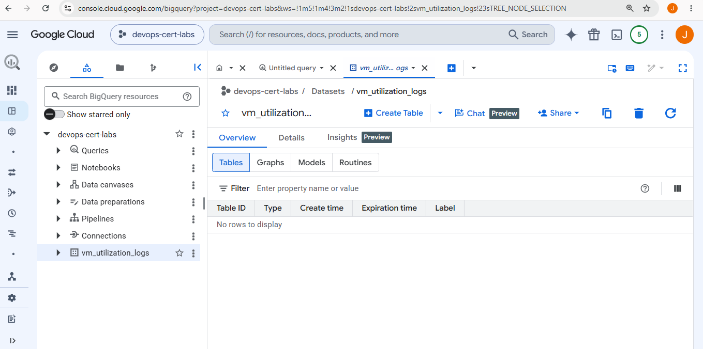

COMMAND

```
gcloud logging sinks list
bq ls
bq ls vm_utilization_logs

https://console.cloud.google.com/bigquery?project=devops-cert-labs&ws=!1m5!1m4!3m2!1sdevops-cert-labs!2svm_utilization_logs!23sTREE_NODE_SELECTION



bq example

SELECT
EXTRACT(YEAR FROM timestamp) AS year,
EXTRACT(QUARTER FROM timestamp) AS quarter,
COUNT(*) AS total_logs
FROM `devops-cert-labs.vm_utilization_logs.syslog`
GROUP BY year, quarter
ORDER BY year, quarter;

the proceed to share and add the stakeholders emails or generate a only read url
```

# Google Cloud Professional Cloud DevOps Engineer Lab

# Question - Build an Interactive VM Utilization Dashboard

---

## Introduction

This repository contains a hands-on lab created while preparing for the **Google Cloud Professional Cloud DevOps Engineer** certification.

The objective of this lab is to implement the Google Cloud architecture required to export virtual machine logs from **Cloud Logging (formerly Stackdriver)** to **BigQuery**, allowing the data to be used by **Looker Studio (formerly Data Studio)** to create interactive dashboards.

The exam scenario requires a solution that is:

- Easy to share.
- Updated automatically.
- Able to aggregate historical information (for example, quarterly reports).
- Built only with Google Cloud services.

---

# Exam Question

> You currently store the virtual machine (VM) utilization logs in Stackdriver. You need to provide an easy-to-share interactive VM utilization dashboard that is updated in real time and contains information aggregated on a quarterly basis. You want to use Google Cloud Platform solutions. What should you do?

### A

1. Export VM utilization logs from Stackdriver to BigQuery.
2. Create a dashboard in Data Studio.
3. Share the dashboard with your stakeholders.

### B

1. Export VM utilization logs from Stackdriver to Cloud Pub/Sub.
2. Send the logs to a SIEM platform.
3. Build dashboards in the SIEM system.

### C

1. Export VM utilization logs from Stackdriver to BigQuery.
2. Export the logs to CSV.
3. Import the CSV into Google Sheets.
4. Build the dashboard in Google Sheets.

### D

1. Export VM utilization logs to Cloud Storage.
2. Develop a custom application.
3. Build a custom dashboard.

---

# Correct Answer

✅ **Answer A**

---

# Why Answer A is Correct

Google Cloud already provides a complete analytics solution without requiring external systems or custom applications.

The recommended architecture is:

```text
Cloud Logging
        │
        ▼
Logging Sink
        │
        ▼
BigQuery
        │
        ▼
Looker Studio
        │
        ▼
Shared Dashboard
```

This architecture offers several advantages:

- Automatic log export.
- Real-time updates.
- SQL analysis using BigQuery.
- Historical data storage.
- Easy dashboard sharing.
- Native Google Cloud services.

BigQuery can store large amounts of log data and execute SQL queries to aggregate information by month, quarter or year.

Looker Studio connects directly to BigQuery and automatically refreshes dashboard data without exporting CSV files.

---

# Why the Other Answers are Incorrect

## Answer B

Cloud Pub/Sub and an external SIEM add unnecessary complexity.

The question specifically asks for a Google Cloud solution that is easy to share.

Using a third-party SIEM is not required because BigQuery and Looker Studio already provide analytics and visualization.

---

## Answer C

Exporting logs to CSV breaks the automatic update process.

Every new log would require another export.

Google Sheets is not designed to analyze large volumes of log data.

---

## Answer D

Building a custom visualization application requires unnecessary development and maintenance.

Google Cloud already provides Looker Studio for this purpose.

Creating a custom dashboard increases operational complexity without adding benefits.

---

# Terraform Resources

This lab creates the required infrastructure using Terraform.

## APIs

- Cloud Logging API
- BigQuery API

---

## BigQuery Dataset

A dataset named:

```text
vm_utilization_logs
```

stores all exported Compute Engine logs.

---

## Logging Sink

A Cloud Logging Sink exports every Compute Engine log into the BigQuery dataset.

Terraform resource:

```hcl
google_logging_project_sink
```

Filter:

```text
resource.type="gce_instance"
```

This means only Compute Engine logs are exported.

---

## IAM Permissions

The Logging Sink automatically creates a service account.

Terraform grants this account the required permission:

```text
roles/bigquery.dataEditor
```

Without this permission, Cloud Logging cannot write into BigQuery.

---

# Deployment

Initialize Terraform.

```bash
terraform init
```

Create the execution plan.

```bash
terraform plan
```

Deploy the infrastructure.

```bash
terraform apply
```

---

# Validation

## 1. Verify the Logging Sink

```bash
gcloud logging sinks list
```

Expected output:

```text
vm-utilization-to-bigquery
```

Destination:

```text
bigquery.googleapis.com/projects/devops-cert-labs/datasets/vm_utilization_logs
```

---

## 2. Verify the Dataset

```bash
bq show devops-cert-labs:vm_utilization_logs
```

The dataset should exist.

---

## 3. Verify IAM Permissions

The dataset permissions should contain the Logging service account.

Example:

```text
service-xxxxxxxx@gcp-sa-logging.iam.gserviceaccount.com
```

Role:

```text
WRITER
```

This confirms Cloud Logging can write into BigQuery.

---

## 4. Generate Logs

If Compute Engine virtual machines are running, Cloud Logging exports every new matching log automatically.

BigQuery creates the required tables when the first logs arrive.

---

## 5. Connect Looker Studio

Open:

https://lookerstudio.google.com/

Create a new report.

Select:

- BigQuery
- Project
- Dataset

Once connected, dashboards update automatically as new logs arrive.

---

# Important Note

This Terraform project creates the export infrastructure only.

The exam scenario assumes Compute Engine virtual machines already exist and are generating logs.

If no Compute Engine instances are running, the BigQuery dataset will remain empty because Cloud Logging only exports **new** log entries that match:

```text
resource.type="gce_instance"
```

This behavior is expected.

---

# Architecture

```text
                +----------------------+
                |  Compute Engine VM   |
                +----------+-----------+
                           |
                           |
                           ▼
                +----------------------+
                |   Cloud Logging      |
                +----------+-----------+
                           |
                    Logging Sink
                           |
                           ▼
                +----------------------+
                |      BigQuery        |
                +----------+-----------+
                           |
                           ▼
                +----------------------+
                |    Looker Studio     |
                +----------+-----------+
                           |
                           ▼
                Shared Interactive Dashboard
```

---

# Conclusion

This lab demonstrates the recommended Google Cloud architecture for creating interactive VM utilization dashboards.

Instead of exporting data manually or developing custom software, Cloud Logging exports logs directly to BigQuery using a Logging Sink.

BigQuery stores and analyzes historical data, while Looker Studio creates interactive dashboards that can be easily shared with stakeholders.

This solution is scalable, managed, and follows Google Cloud best practices, making **Answer A** the correct choice for the exam.