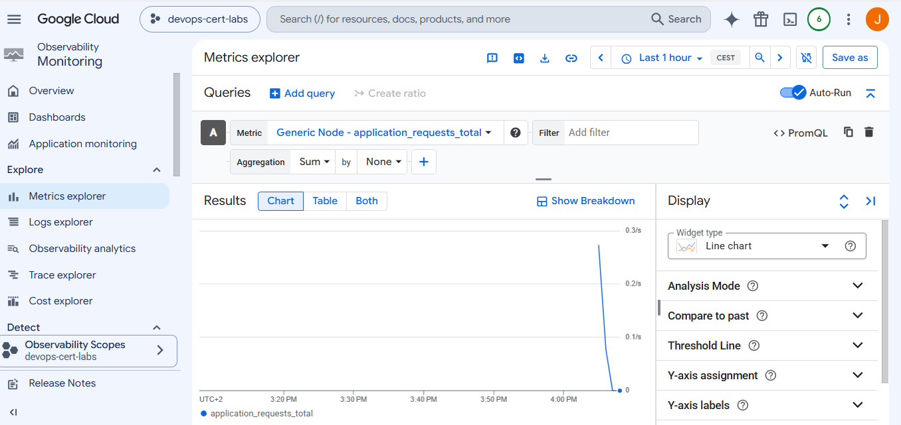

COMMANDS

```
####################################################
# GET GKE CREDENTIALS
####################################################

gcloud container clusters get-credentials otel-metrics-lab --zone europe-west1-b

####################################################
# VERIFY PODS
####################################################

kubectl get pods -n production

####################################################
# VERIFY SERVICES
####################################################

kubectl get svc -n production

####################################################
# TEST APPLICATION
####################################################

curl.exe http://$(terraform output -raw application_url)

####################################################
# GENERATE TRAFFIC
####################################################

for ($i=1; $i -le 20; $i++) {
    curl.exe http://$(terraform output -raw application_url) | Out-Null
}

####################################################
# VERIFY LAST 100 LINES OF OTEL COLLECTOR LOGS
####################################################

kubectl logs deployment/otel-collector -n production --tail=100
```

Cloud Monitoring
→ Metrics Explorer



# Google Cloud Professional Cloud DevOps Engineer Lab

# Question - Monitor a Kubernetes Application Using OpenTelemetry and Cloud Monitoring

---

## Introduction

This repository contains a hands-on lab created while preparing for the **Google Cloud Professional Cloud DevOps Engineer** certification.

The goal of this lab is to understand how a Kubernetes application can expose custom application metrics using **OpenTelemetry**, send them to an **OpenTelemetry Collector**, and finally export them to **Google Cloud Monitoring**.

The lab also demonstrates why the correct answer in the certification exam is to instrument the application itself instead of relying only on infrastructure metrics.

---

# Exam Question

A development team deployed a Node.js application on Google Kubernetes Engine (GKE).

The application already runs correctly, but the team wants to monitor business and application metrics such as:

* Number of requests
* Response latency
* Custom application metrics

These metrics must be available inside **Google Cloud Monitoring**.

Which solution should be implemented?

**Correct Answer:**

> **C — Install the OpenTelemetry client libraries in the application, configure Google Cloud Monitoring as the export destination, and observe application metrics in Cloud Monitoring.**

---

# Why Answer C is Correct

Infrastructure metrics only show information about the Kubernetes cluster, CPU usage, memory consumption or network traffic.

They cannot provide information generated inside the application itself.

The application must be instrumented using OpenTelemetry libraries so it can create custom metrics.

These metrics are exported to an OpenTelemetry Collector, which forwards them to Google Cloud Monitoring.

This architecture is recommended by Google because it separates metric collection from metric export and supports multiple backends.

---

# Why the Other Answers are Incorrect

### Answer A

Using only Cloud Monitoring dashboards does not create new application metrics.

Dashboards only display metrics that already exist.

---

### Answer B

Kubernetes metrics only monitor cluster resources.

They cannot measure business information such as request counters or custom latency histograms.

---

### Answer D

Cloud Logging collects logs instead of metrics.

Logs can be useful for troubleshooting, but they are not the correct solution for monitoring custom application metrics.

---

# Architecture

```
                    +----------------------+
                    |    Internet Client   |
                    +----------+-----------+
                               |
                               |
                      LoadBalancer Service
                               |
                               |
                      Node.js Application
                               |
             OpenTelemetry Client Libraries
                               |
                        OTLP HTTP Export
                               |
                               |
                 OpenTelemetry Collector
                               |
             +-----------------+----------------+
             |                                  |
             |                                  |
      Debug Exporter                 Google Cloud Monitoring
             |                                  |
             |                                  |
      Collector Logs                 Cloud Monitoring Metrics
```

---

# Terraform Resources

The infrastructure is completely deployed using Terraform.

The project automatically creates:

* Google Cloud APIs
* GKE Cluster
* Kubernetes Namespace
* Node Pool
* Node.js Application
* OpenTelemetry Collector
* ConfigMaps
* Kubernetes Services
* Public Load Balancer

Everything is created using Infrastructure as Code.

---

# Terraform Configuration

## Google Provider

The Google provider authenticates Terraform and selects the project and region where all resources will be created.

```terraform
provider "google" {
  project = "devops-cert-labs"
  region  = "europe-west1"
}
```

---

## Required APIs

Terraform enables all required Google Cloud services automatically.

* Kubernetes Engine API
* Cloud Monitoring API
* Cloud Logging API

Without these APIs the deployment cannot succeed.

---

## GKE Cluster

A small Google Kubernetes Engine cluster is created.

Configuration:

* 1 node
* e2-small machine
* Standard persistent disk
* Preemptible VM

The cluster is sufficient for demonstrating application monitoring.

---

## Kubernetes Namespace

A dedicated namespace called **production** is created.

This keeps the application isolated from the default namespace.

---

# Node.js Application

Instead of building a Docker image, the source code is stored inside a Kubernetes ConfigMap.

The container copies the source code into an empty directory, installs the required dependencies and starts the application.

This makes the entire lab self-contained.

---

# OpenTelemetry Instrumentation

The Node.js application imports several OpenTelemetry libraries.

```javascript
const { metrics } = require("@opentelemetry/api");
```

These libraries allow the application to create its own metrics.

---

## Counter Metric

A Counter records the total number of requests.

```javascript
requestCounter.add(1);
```

Each HTTP request increases the counter by one.

---

## Histogram Metric

A Histogram measures response latency.

```javascript
latencyHistogram.record(latency);
```

The histogram stores latency values and allows Cloud Monitoring to calculate averages, percentiles and distributions.

---

# OTLP Exporter

The application exports metrics using OTLP HTTP.

```javascript
url: "http://otel-collector:4318/v1/metrics"
```

The application never communicates directly with Cloud Monitoring.

Instead, all metrics are sent to the OpenTelemetry Collector.

---

# OpenTelemetry Collector

The Collector receives metrics from the application.

Its responsibilities are:

* Receive OTLP metrics
* Process metrics
* Export metrics
* Send debugging information

The Collector acts as a central gateway.

---

# Collector Configuration

The Collector configuration contains four important sections.

## Receiver

Receives metrics using HTTP and gRPC.

```yaml
receivers:
  otlp:
```

---

## Processor

Processes metric batches before exporting.

```yaml
processors:
  batch:
```

---

## Exporters

Two exporters are configured.

### Debug Exporter

Prints metrics inside the Collector logs.

This exporter is extremely useful during development because it allows verification that metrics are arriving correctly.

---

### Google Cloud Exporter

Sends metrics directly to Cloud Monitoring.

```yaml
exporters:
  googlecloud:
```

---

## Pipeline

The pipeline connects everything together.

```
Receiver

↓

Processor

↓

Exporters
```

This is the standard OpenTelemetry architecture.

---

# Kubernetes Services

Three services are created.

## Node Service

Allows communication inside the Kubernetes cluster.

---

## OpenTelemetry Service

Allows the application to send OTLP metrics to the Collector.

---

## LoadBalancer Service

Creates a public external IP.

This allows testing the application directly from the Internet.

---

# Outputs

Terraform generates several useful outputs.

Examples include:

* Public IP
* Curl command
* Health endpoint
* Traffic generation script
* Pod verification
* Service verification
* Collector logs

This makes testing easier after deployment.

---

# Verification

After deployment, Kubernetes resources can be verified.

```powershell
kubectl get pods -n production
```

Expected result:

```
node-app
otel-collector
```

---

The application can be tested.

```powershell
curl http://PUBLIC_IP
```

Example response:

```json
{
  "application":"Node Demo",
  "status":"healthy",
  "latency_ms":1
}
```

---

Traffic can be generated.

```powershell
for ($i=1; $i -le 20; $i++) {
    curl.exe http://PUBLIC_IP | Out-Null
}
```

---

Collector logs can be verified.

```powershell
kubectl logs deployment/otel-collector -n production --tail=100
```

Expected output:

```
Metric #0
application_requests_total

Metric #1
application_latency_ms
```

These logs confirm that the Collector successfully receives application metrics.

---

# IAM Permission

During development the Google Cloud exporter initially returned the following error:

```
PermissionDenied

monitoring.timeSeries.create denied
```

The GKE node service account did not have permission to write custom metrics into Cloud Monitoring.

The issue was fixed by granting the following IAM role:

```
Monitoring Metric Writer
```

After assigning this role, the exporter successfully sent metrics to Google Cloud Monitoring.

---

# What This Lab Demonstrates

This lab demonstrates several important DevOps concepts.

* Infrastructure as Code with Terraform
* Google Kubernetes Engine deployment
* Kubernetes ConfigMaps
* Kubernetes Services
* OpenTelemetry instrumentation
* Custom application metrics
* OpenTelemetry Collector
* Google Cloud Monitoring integration
* IAM permissions
* Observability best practices

---

# Key Learning Points

* Infrastructure metrics are different from application metrics.
* OpenTelemetry libraries must be installed inside the application.
* The OpenTelemetry Collector centralizes metric collection and export.
* Google Cloud Monitoring stores and visualizes application metrics.
* IAM permissions are required for exporting custom metrics.
* Terraform can deploy the complete observability platform automatically.

---

# Conclusion

This lab demonstrates the complete monitoring workflow recommended by Google Cloud.

The Node.js application generates custom metrics using OpenTelemetry client libraries. These metrics are sent to an OpenTelemetry Collector through the OTLP protocol. The Collector processes the metrics and exports them to Google Cloud Monitoring, where they can be visualized and analyzed.

This architecture is scalable, follows modern observability practices, and matches the recommended solution for the **Google Cloud Professional Cloud DevOps Engineer** certification exam.

**Correct Exam Answer:** **C — Install the OpenTelemetry client libraries in the application, configure Google Cloud Monitoring as the export destination, and observe application metrics in Cloud Monitoring.**
