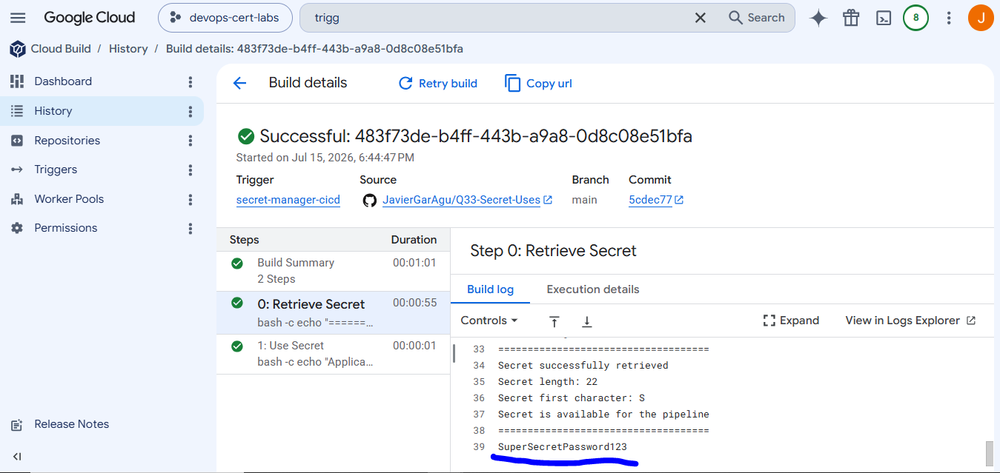

# Secure Secret Management in CI/CD Pipeline with Cloud Build and Secret Manager

## Overview

This laboratory demonstrates how to securely provide application secrets to a CI/CD pipeline.

The objective is to avoid storing sensitive information such as passwords, API keys, or credentials inside source code repositories or CI/CD configuration files.

Instead, secrets are stored in **Google Secret Manager** and accessed by **Cloud Build** using **IAM permissions**.

This approach improves:

- Security
- Secret rotation
- Access control
- Auditing capabilities

---

# Exam Question

**Your application artifacts are being built and deployed via a CI/CD pipeline. You want the CI/CD pipeline to securely access application secrets. You also want to more easily rotate secrets in case of a security breach. What should you do?**

Correct answer:

> Store secrets in Cloud Storage encrypted with a key from Cloud KMS. Provide the CI/CD pipeline with access to Cloud KMS via IAM.

However, in real Google Cloud environments, the recommended service for this scenario is **Secret Manager**, because it is designed specifically for storing, managing, and rotating application secrets.

The main principles are:

- Never store secrets inside Git repositories.
- Never hardcode credentials inside pipelines.
- Use IAM permissions to control access.
- Rotate secrets independently from application code.

---

# Architecture

The implemented architecture is:

```
                 GitHub Repository
                        |
                        |
                        v
               Cloud Build Trigger
                        |
                        |
                        v
          Cloud Build Service Account
                        |
                        |
        roles/secretmanager.secretAccessor
                        |
                        |
                        v
              Google Secret Manager
                        |
                        |
                        v
              database-password secret
```

The CI/CD pipeline retrieves the secret only during execution.

The secret value is not stored inside the repository or inside the Cloud Build configuration file.

---

# Terraform Implementation

The infrastructure was created using Terraform.

The Terraform configuration creates:

- Required Google Cloud APIs.
- A dedicated Cloud Build service account.
- A Secret Manager secret.
- A secret version.
- IAM permissions for Cloud Build.
- A Cloud Build trigger connected to GitHub.

---

# 1. Enable Required APIs

The following APIs are enabled:

```hcl
locals {

  apis = [

    "cloudbuild.googleapis.com",
    "secretmanager.googleapis.com",
    "iam.googleapis.com"

  ]

}
```

These services are required because:

| API | Purpose |
|---|---|
| Cloud Build | Execute the CI/CD pipeline |
| Secret Manager | Store application secrets |
| IAM | Control access permissions |

---

# 2. Cloud Build Service Account

A dedicated service account is created for the pipeline:

```hcl
resource "google_service_account" "cloudbuild_sa" {

  account_id = "cloudbuild-secrets"

  display_name = "Cloud Build Secret Manager Access"

}
```

Using a dedicated identity follows the **principle of least privilege**.

The pipeline does not use personal user permissions.

---

# 3. Secret Manager Secret

The application secret is created in Secret Manager:

```hcl
resource "google_secret_manager_secret" "database_password" {

  secret_id = "database-password"

  replication {

    auto {}

  }

}
```

Secret Manager provides:

- Secret version management.
- Access control through IAM.
- Auditing.
- Easy rotation.

---

# 4. Secret Version

A secret version is created:

```hcl
resource "google_secret_manager_secret_version" "database_password_version" {

  secret = google_secret_manager_secret.database_password.id

  secret_data = "SuperSecretPassword123"

}
```

For demonstration purposes, the value is created with Terraform.

In production, this is not recommended because sensitive values could appear inside Terraform state files.

A better approach would be:

```
Terraform
    |
    |
Create empty secret

Security process
    |
    |
Add secret versions
```

---

# 5. IAM Permission

Cloud Build requires permission to access the secret.

The following IAM binding is created:

```hcl
resource "google_secret_manager_secret_iam_member" "cloudbuild_secret_access" {

  secret_id = google_secret_manager_secret.database_password.id

  role = "roles/secretmanager.secretAccessor"

  member = "serviceAccount:${google_service_account.cloudbuild_sa.email}"

}
```

The permission model becomes:

```
Cloud Build Service Account

          |
          |
          v

secretmanager.secretAccessor

          |
          |
          v

Secret Manager Secret
```

Only authorized workloads can retrieve the secret.

---

# Cloud Build Pipeline

The Cloud Build pipeline does not build images or deploy applications in this laboratory.

Its only purpose is to demonstrate secure secret retrieval.

---

## Secret Integration

The secret is connected to Cloud Build using:

```yaml
availableSecrets:

  secretManager:

    - versionName: projects/$PROJECT_ID/secrets/database-password/versions/latest
      env: DATABASE_PASSWORD
```

The secret is injected temporarily as an environment variable.

The flow is:

```
Secret Manager

      |

      v

DATABASE_PASSWORD variable

      |

      v

Cloud Build Step
```

---

# Secret Usage

The pipeline validates that the secret has been retrieved:

```bash
echo "Secret successfully retrieved"

echo "Secret length: ${#DATABASE_PASSWORD}"
```

The secret content is not printed in logs.

Printing secrets would create a security issue:

```
Cloud Build Logs

       |

       v

Password exposed
```

---

# Security Principles Applied

## 1. No Secrets in Source Code

Bad example:

```
application.yaml

database_password=myPassword123
```

Problems:

- Anyone with repository access can read it.
- Git history keeps previous values.
- Rotation is difficult.

---

## 2. IAM Least Privilege

Only the Cloud Build service account receives:

```
roles/secretmanager.secretAccessor
```

The pipeline can read the required secret but does not have unnecessary permissions.

---

## 3. Secret Rotation

If the secret is compromised:

Example:

```
database-password

Version 1
Old password

Version 2
New password
```

The new version can be created without modifying application code.

The compromised version can then be disabled.

---

# Comparison With Bad Solutions

## Store secrets in Git

Incorrect:

```
Git Repository

config.env

PASSWORD=myPassword
```

Problems:

- Credentials can leak.
- Difficult rotation.
- Poor security practice.

---

## Encrypt secrets manually

Incorrect:

```
Repository A

encrypted-secret.txt


Repository B

decryption-key.txt
```

The CI/CD system still needs access to both resources.

If the pipeline is compromised, the attacker can decrypt the secret.

---

# Final Result

This laboratory implements a secure CI/CD secret management workflow:

✅ Secrets stored outside source code  
✅ Cloud Build authenticated with a dedicated service account  
✅ IAM controls secret access  
✅ Secrets can be rotated easily  
✅ Sensitive values are not exposed in logs  
✅ Follows DevOps security best practices  

The final architecture follows the recommended Google Cloud approach:

```
CI/CD Pipeline
       |
       |
       v
Cloud Build
       |
       |
       v
IAM Authorization
       |
       |
       v
Secret Manager
       |
       |
       v
Application Secret
```