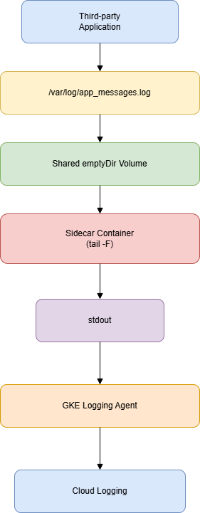

gcloud container clusters get-credentials logging-sidecar-lab --zone europe-west1-b --project devops-cert-labs

kubectl get pods -n production

kubectl logs -n production third-party-app-795cb9f56b-5kf8c -c log-sidecar

gcloud logging logs list

gcloud logging read "resource.type=k8s_container AND resource.labels.namespace_name=production" --limit=1

There is debate because **both B and D are technically possible**, but the exam asks what you **should** do, meaning the solution that best follows Google Cloud and Kubernetes best practices.

Option **B** suggests deploying a Fluentd DaemonSet and customizing it to tail the application's log file and forward it to Cloud Logging. This is technically feasible, and in older Stackdriver deployments it was common to customize Fluentd. However, the log file (`/var/log/app_messages.log`) exists inside the application's container filesystem. A DaemonSet running on the node cannot simply read that file without additional changes such as volume mounts or other deployment modifications. The option oversimplifies that part and introduces unnecessary operational complexity.

Option **D** follows the standard Kubernetes logging pattern for unmodifiable applications. A sidecar container shares a volume with the application, tails the log file, and writes its contents to stdout. Since GKE automatically collects stdout and stderr from containers and sends them to Cloud Logging, no custom logging agent configuration is required. The application remains unchanged, and the solution is isolated to a single pod.

The reason you will find conflicting answers online is that this is an older Stackdriver-era question. Some unofficial exam dumps and discussion forums favor Fluentd because it was historically used for custom log collection. However, according to current Kubernetes and GKE best practices, the sidecar pattern is the preferred solution for an application that cannot be modified and writes logs to a file.

In short:

* **B**: Technically possible, but more complex and not the recommended approach for this scenario.
* **D**: The Kubernetes-native and Google-recommended solution, making it the best answer for this exam question.

A sidecar is a secondary container that runs inside the same Pod as the main application container. Both containers share the same network namespace and can share storage through Kubernetes volumes. The sidecar extends or supports the main application without requiring any changes to its code.

The sidecar pattern is commonly used for tasks such as:

Log collection
Monitoring and metrics
Service mesh proxies
Configuration synchronization
Security features

In this lab, the main application is a third-party application that cannot be modified. Instead of writing logs to stdout, it writes them to a file:

/var/log/app_messages.log

Since GKE automatically collects logs only from stdout and stderr, those file-based logs would never reach Cloud Logging on their own.

To solve this, we deploy a sidecar container in the same Pod. Both containers mount the same emptyDir volume at /var/log, allowing them to access the same log file.

The application writes log entries to:

/var/log/app_messages.log

The sidecar continuously runs:

tail -F /var/log/app_messages.log

The tail -F command reads every new line appended to the file and prints it to the sidecar's standard output (stdout).

GKE's logging agent automatically collects everything written to the sidecar's stdout and forwards it to Cloud Logging.

The data flow in the lab is:

The key idea is that we never modify the application. Instead, we add a helper container (the sidecar) that adapts the application's logging behavior to match Kubernetes' native logging model. This is why the sidecar pattern is considered the recommended solution for this scenario.