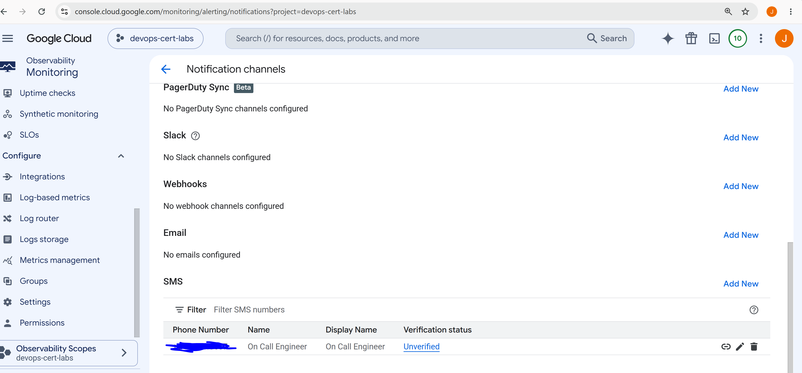
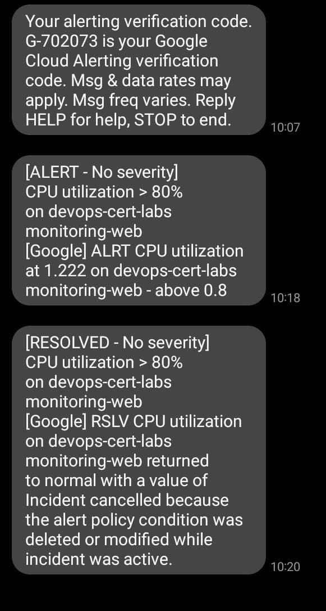

VERIFY YOUR NUMBER: Google Cloud Console → Monitoring → Alerting → Notification channels → SMS

https://console.cloud.google.com/monitoring/alerting/notifications?project=devops-cert-labs



COMMANDS

```
#ssh into the vm
sudo apt-get install -y stress
stress --cpu 4 --timeout 300
```

RESULT



# SMS Notifications with Cloud Monitoring using Terraform

## Overview

This lab demonstrates how to configure native SMS notifications in Google Cloud Monitoring for critical alerts.

The infrastructure is created with Terraform and includes a Compute Engine virtual machine, an SMS notification channel, and an alert policy that sends an SMS when the VM CPU utilization stays above the configured threshold.

This implementation follows the recommended Google Cloud approach and answers the certification question correctly.

**Correct answer:** **C**

> Ensure that team members configure their phone numbers in Cloud Monitoring, create an SMS notification channel, and attach it to the alerting policy.

---

# Architecture

```
                    +----------------------+
                    | Compute Engine VM    |
                    | monitoring-web       |
                    +----------+-----------+
                               |
                               | CPU Metrics
                               |
                               v
                 Cloud Monitoring collects metrics
                               |
                               v
                  Alert Policy evaluates condition
                               |
                  CPU > 80% for 120 seconds
                               |
                               v
                  SMS Notification Channel
                               |
                               v
                     Verified Phone Number
                               |
                               v
                         SMS Notification
```

---

# Terraform Resources

## Provider

The Google provider authenticates Terraform and defines the project, region, and zone where all resources will be deployed.

```hcl
provider "google"
```

---

## Required APIs

Terraform enables the Google Cloud APIs required by the lab.

* Compute Engine API
* Cloud Monitoring API
* Cloud Logging API

Without these services, the VM and Monitoring resources cannot be created.

---

## Firewall Rule

A firewall rule allows HTTP traffic on port 80.

Although it is not directly related to Monitoring, it makes the VM accessible and allows a simple web server to run.

---

## Compute Engine Instance

Terraform creates a Debian virtual machine named:

```
monitoring-web
```

The startup script performs several tasks:

* Updates the operating system.
* Installs Nginx.
* Installs the stress utility.
* Starts the web server.

The VM automatically exports CPU metrics to Cloud Monitoring because it uses the default Google service account with Cloud Platform access.

---

## SMS Notification Channel

The most important resource in this lab is the SMS notification channel.

```hcl
resource "google_monitoring_notification_channel"
```

It defines:

* Display name
* Notification type (SMS)
* Phone number

Example:

```text
+34600111222
```

The phone number must use the international E.164 format.

After Terraform creates the resource, Google Cloud sends a verification code by SMS.

The notification channel becomes active only after the owner verifies the phone number from the Cloud Monitoring console.

---

## Alert Policy

Terraform creates a Monitoring alert policy.

The policy continuously evaluates the metric:

```
compute.googleapis.com/instance/cpu/utilization
```

The condition is triggered when:

* CPU utilization is greater than 80%
* The condition remains true for 120 seconds

When both conditions are satisfied, Cloud Monitoring sends an SMS through the configured notification channel.

The policy also includes documentation describing the incident.

---

## Outputs

Terraform prints useful information after deployment, including:

* VM name
* Notification channel
* Alert policy
* Exam answer
* Explanation of why answer C is correct

---

# Deployment

Initialize Terraform.

```bash
terraform init
```

Review the execution plan.

```bash
terraform plan
```

Deploy the infrastructure.

```bash
terraform apply
```

---

# Phone Number Verification

After the infrastructure is deployed:

1. Open **Google Cloud Console**.
2. Navigate to **Monitoring**.
3. Open **Alerting**.
4. Open **Notification channels**.
5. Select the SMS channel.
6. Verify the phone number using the code received by SMS.

The notification channel cannot send alerts until it has been verified.

---

# Testing the Alert

Connect to the VM.

```bash
gcloud compute ssh monitoring-web --zone=europe-west1-b
```

Generate CPU load.

```bash
stress --cpu $(nproc) --timeout 600
```

This command uses all available CPU cores for ten minutes.

Cloud Monitoring collects CPU metrics approximately every minute.

After the CPU utilization remains above the configured threshold for two minutes, the alert policy is evaluated and an SMS notification is sent.

---

# Monitoring the Metrics

CPU utilization can be viewed from:

**Monitoring → Metrics Explorer**

Select:

* Resource type: VM Instance
* Metric: CPU Utilization

The graph should show CPU usage increasing while the stress process is running.

The current alert status can be viewed from:

**Monitoring → Alerting**

The alert changes through the following states:

* OK
* Pending
* Firing

---

# Why Answer C is Correct

Cloud Monitoring provides native support for SMS notification channels.

Each team member registers and verifies their own phone number inside Google Cloud Monitoring. The verified SMS notification channel is then attached directly to one or more alert policies.

No third-party SMS gateway, webhook, or Slack integration is required.

Options A, B, and D introduce unnecessary external services, while Google Cloud already includes built-in SMS notifications.
