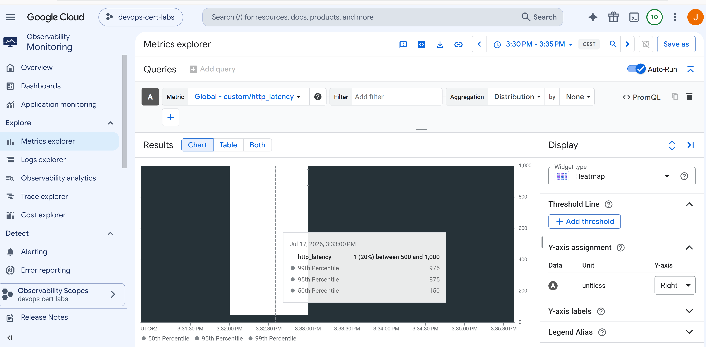

Search in metrics explorer custom.googleapis.com/http_latency



# HTTP Latency Monitoring with Custom Metrics

## Overview

This lab demonstrates how to create and publish a custom HTTP latency metric in Google Cloud Monitoring using Terraform and Python.

The goal is to reproduce the scenario from the Google Professional Cloud DevOps Engineer certification exam, where an application exposes an HTTP endpoint without using a load balancer. Since there is no load balancer collecting latency statistics, the application must publish its own latency metrics to Cloud Monitoring.

The metric is implemented as a **GAUGE** with a **DISTRIBUTION** value type, allowing Cloud Monitoring to visualize latency distributions using a **Heatmap**.

---

# Exam Question

You are managing an application that exposes an HTTP endpoint without using a load balancer. The latency of the HTTP responses is important for the user experience. You want to understand what HTTP latencies all of your users are experiencing. You use Cloud Monitoring. What should you do?

### Correct answer

**C**

* Create a custom metric with:

  * **metricKind = GAUGE**
  * **valueType = DISTRIBUTION**
* Visualize the metric using a **Heatmap** in Metrics Explorer.

---

# Architecture

The lab deploys the following resources:

* Cloud Monitoring API
* Service Account
* IAM permissions to publish custom metrics
* Ubuntu virtual machine
* Python virtual environment
* Python application that generates latency samples
* Custom Cloud Monitoring metric

```
Terraform
      │
      ▼
Ubuntu VM
      │
      ▼
Python Script
      │
      ▼
Custom Metric
(custom.googleapis.com/http_latency)
      │
      ▼
Cloud Monitoring
      │
      ▼
Metrics Explorer Heatmap
```

---

# Terraform Configuration

The Terraform configuration automates the entire environment.

It performs the following tasks:

* Enables the Cloud Monitoring API.
* Creates a dedicated service account.
* Grants the **Monitoring Metric Writer** role.
* Creates an Ubuntu virtual machine.
* Installs Python and the required packages.
* Creates a Python virtual environment.
* Executes the monitoring script automatically during the VM startup.

Everything is provisioned automatically after running Terraform.

---

# Python Virtual Environment

Instead of installing Python packages globally, the startup script creates an isolated virtual environment.

```text
/opt/http-latency/venv
```

The required library is installed inside the virtual environment:

```
google-cloud-monitoring
```

This approach keeps the operating system clean and follows good operational practices.

---

# Python Script

The startup script creates a Python application that interacts with Cloud Monitoring.

The script performs the following actions:

1. Creates the custom metric if it does not already exist.
2. Generates several random HTTP latency values.
3. Builds a Distribution object.
4. Sends the distribution as a custom metric.
5. Exits after publishing the sample.

The generated latency values simulate HTTP response times that could be produced by a real application.

Example values:

```
34 ms
72 ms
118 ms
245 ms
612 ms
```

These values are grouped into a distribution instead of being sent individually.

---

# Custom Metric

Metric name:

```
custom.googleapis.com/http_latency
```

Metric Kind:

```
GAUGE
```

Value Type:

```
DISTRIBUTION
```

This is the recommended format for latency metrics because it preserves the complete distribution of response times instead of storing only a single numeric value.

Cloud Monitoring can then calculate:

* Percentiles
* Histograms
* Heatmaps
* Latency trends

without requiring additional processing.

---

# Why DISTRIBUTION?

Using a DOUBLE metric would only provide one value per sample.

A DISTRIBUTION metric stores an entire latency histogram.

This allows Cloud Monitoring to answer questions such as:

* How many requests were slower than 200 ms?
* What is the 95th percentile?
* Are there latency spikes?
* How are response times distributed over time?

This makes DISTRIBUTION the best option for monitoring HTTP latency.

---

# Heatmap Visualization

After the metric is published, it can be opened in **Metrics Explorer**.

Select:

* Metric:

  ```
  custom.googleapis.com/http_latency
  ```

Choose the visualization type:

```
Heatmap
```

A Heatmap displays the distribution of latency values over time instead of only plotting a single average value.

This makes it much easier to identify latency spikes and performance degradation.

---

# Fixed Latency Generation

For this lab, the latency generation was intentionally left as a fixed simulation.

Each execution generates several predefined random latency samples and publishes them immediately.

This approach keeps the lab simple while still demonstrating how Cloud Monitoring handles DISTRIBUTION metrics and Heatmap visualizations.

A production application would normally measure the real execution time of each HTTP request before publishing the metric.

---

# Verification

After Terraform finishes:

1. Open **Cloud Monitoring**.
2. Go to **Metrics Explorer**.
3. Select:

```
custom.googleapis.com/http_latency
```

4. Choose the **Heatmap** visualization.
5. Select a time range such as **Last 1 hour**.

The custom latency metric should now be visible.

---

# Conclusion

This lab demonstrates how applications can publish their own latency information when no load balancer is available.

Using a **GAUGE** metric with a **DISTRIBUTION** value type allows Cloud Monitoring to store complete latency distributions and visualize them with Heatmaps.

This is the recommended approach for monitoring HTTP response latency and corresponds to the correct answer (**C**) in the Google Professional Cloud DevOps Engineer certification exam.
