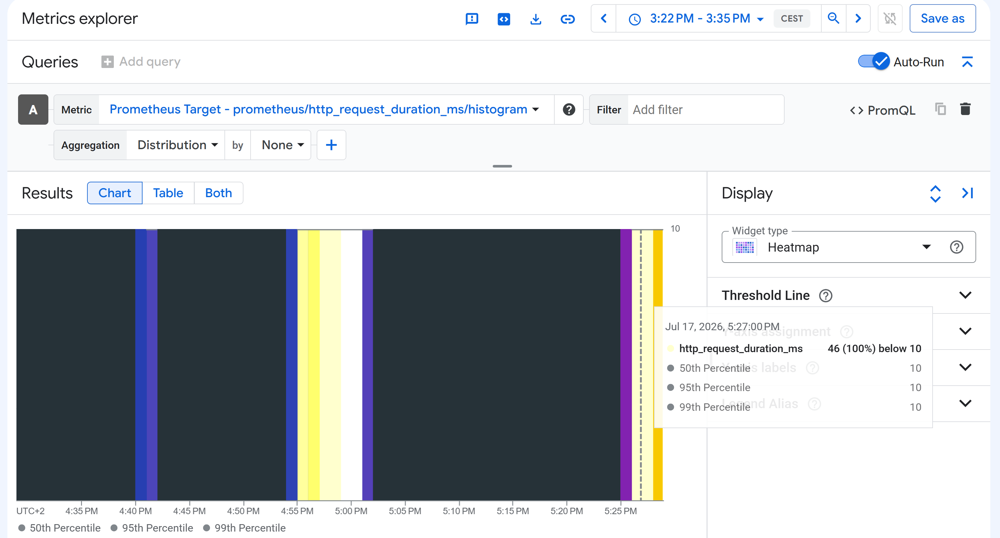

COMMANDS
```
gcloud container clusters get-credentials openmetrics-lab --zone europe-west1-b --project devops-cert-labs
kubectl apply -f podmonitoring.yaml
kubectl get svc node-app -n production
curl.exe http://EXTERNAL-IP:8080
#repeat curl
while ($true) {
    curl.exe http://207.175.9.138:8080
    Start-Sleep 1
}
#individual
curl.exe http://207.175.9.138:8080/metrics
# TYPE http_request_duration_ms histogram
<!-- http_request_duration_ms_bucket{le="10"} 9
http_request_duration_ms_bucket{le="25"} 9
http_request_duration_ms_bucket{le="50"} 9
http_request_duration_ms_bucket{le="100"} 9
http_request_duration_ms_bucket{le="250"} 9
http_request_duration_ms_bucket{le="500"} 9
http_request_duration_ms_bucket{le="1000"} 9
http_request_duration_ms_bucket{le="+Inf"} 9 -->
#http_request_duration_ms_sum 2.020235097

gcloud monitoring metrics descriptors list --project=devops-cert-labs --filter="metric.type:prometheus.googleapis.com/http_request"
curl.exe -H "Authorization: Bearer $(gcloud auth print-access-token)" `
"https://monitoring.googleapis.com/v3/projects/devops-cert-labs/metricDescriptors?filter=metric.type%3Dstarts_with(%22prometheus.googleapis.com/http_request%22)"
```

Search in Metrics Explorer prometheus.googleapis.com/http_request_duration_ms_bucket



# OpenMetrics with Google Cloud Managed Service for Prometheus

## Question

Your team is designing a new application for deployment both inside and outside Google Cloud Platform (GCP). You need to collect detailed metrics such as system resource utilization. You want to use centralized GCP services while minimizing the amount of work required to set up this collection system.

**Correct answer: A**

> **Import the OpenMetrics package into your application, and configure it to export metrics to Cloud Monitoring.**

This is the best option because OpenMetrics is the standard format used by Prometheus. Google Cloud Managed Service for Prometheus can scrape these metrics and automatically send them to Cloud Monitoring, providing a centralized monitoring solution for workloads running both inside and outside GCP.

The other options are not correct:

* **B** focuses on logging instead of metrics.
* **C** requires implementing a custom timing solution instead of using the standard OpenMetrics ecosystem.
* **D** introduces an external APM platform, which increases operational complexity and does not minimize setup work.

---

# Architecture

The laboratory deploys a small Node.js application on Google Kubernetes Engine (GKE).

The application exposes an OpenMetrics endpoint that publishes HTTP latency metrics.

Google Cloud Managed Service for Prometheus scrapes the endpoint and stores the collected metrics in Cloud Monitoring.

```
User
   |
   v
LoadBalancer
   |
Node.js Application
   |
/metrics (OpenMetrics)
   |
Managed Service for Prometheus
   |
Cloud Monitoring
```

---

# Main Terraform Components

## Google Provider

The Google provider creates all Google Cloud resources.

It also enables the required APIs:

* Kubernetes Engine API
* Cloud Monitoring API

---

## GKE Cluster

Terraform creates a small Kubernetes cluster in **europe-west1-b**.

Important configuration:

* One node pool
* e2-small virtual machine
* VPC Native networking
* Managed Service for Prometheus enabled

This allows Google Cloud to scrape Prometheus-compatible metrics without installing a complete Prometheus server.

---

## Kubernetes Namespace

A dedicated namespace called **production** is created.

All Kubernetes resources are deployed inside this namespace.

---

## Node.js Application

The application is stored inside a ConfigMap.

Terraform mounts the source code directly into the container when it starts.

The application uses:

* Express
* prom-client

The application exposes two endpoints.

### /

Returns a response after waiting for a random amount of time.

Each request records its latency inside a histogram.

### /metrics

Exports all metrics using the OpenMetrics format.

This endpoint is automatically scraped by Google Cloud Managed Service for Prometheus.

---

## Histogram Metric

The application creates the following custom metric:

```
http_request_duration_ms
```

The metric is implemented as a Prometheus histogram.

Example buckets:

* 10 ms
* 25 ms
* 50 ms
* 100 ms
* 250 ms
* 500 ms
* 1000 ms

Each HTTP request is automatically recorded inside one of these buckets.

Cloud Monitoring later converts this histogram into a Prometheus metric.

---

## Kubernetes Deployment

Terraform creates one application pod.

The startup process is:

1. Copy application files from the ConfigMap.
2. Install Node.js dependencies.
3. Start the Express server.
4. Publish metrics through `/metrics`.

---

## Kubernetes Service

A LoadBalancer service exposes the application to the Internet.

Terraform also names the service port **http**, which allows Managed Service for Prometheus to identify the endpoint correctly.

---

## IAM Permissions

The node pool uses the Cloud Platform OAuth scope.

The Compute Engine default service account should have the **Monitoring Metric Writer** role so Google Cloud can publish the collected metrics into Cloud Monitoring.

---

# Generated Metrics

After generating traffic, the application exports metrics similar to:

```
http_request_duration_ms_bucket
http_request_duration_ms_sum
http_request_duration_ms_count
```

Inside Cloud Monitoring they appear with the prefix:

```
prometheus.googleapis.com/http_request_duration_ms/histogram
```

---

# Generate Traffic

Generate requests to populate the histogram.

PowerShell:

```powershell
1..100 | % {
    Invoke-WebRequest http://LOAD_BALANCER_IP | Out-Null
}
```

Linux:

```bash
for i in {1..100}; do
    curl http://LOAD_BALANCER_IP > /dev/null
done
```

---

# Verify Metrics

Check that the application exposes OpenMetrics.

```bash
curl http://LOAD_BALANCER_IP:8080/metrics
```

You should see metrics such as:

```
http_request_duration_ms_bucket
http_request_duration_ms_sum
http_request_duration_ms_count
```

---

# View Metrics in Cloud Monitoring

Open **Metrics Explorer**.

Search for:

```
prometheus.googleapis.com/http_request_duration_ms/histogram
```

After Managed Service for Prometheus scrapes the application and traffic has been generated, the histogram data becomes available in Cloud Monitoring.

---

# What This Lab Demonstrates

This lab demonstrates how to expose application metrics using the OpenMetrics standard and collect them with Google Cloud Managed Service for Prometheus.

It shows how applications can export detailed performance metrics to Cloud Monitoring with very little configuration, which is exactly the approach described in the correct answer (**A**).


