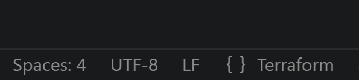

COMMANDS
```
gcloud compute instances list

```

VM COMMANDS

```
# Estado inicial
systemctl is-active google-cloud-ops-agent

# Mensaje que debería llegar
logger "ANTES - $(date)"

# Esperar a que se envíe
sleep 20

# Parar el agente
sudo systemctl stop google-cloud-ops-agent

# Esperar a que se detenga del todo
while systemctl is-active --quiet google-cloud-ops-agent; do
    sleep 1
done

echo "Agente detenido."

# Esperar un poco más para vaciar buffers
sleep 15

# Este NO debería llegar
logger "DURANTE - $(date)"

# Esperar (como el agente está parado, no debería enviarse)
sleep 20

# Arrancar el agente
sudo systemctl start google-cloud-ops-agent

# Esperar a que esté activo
while ! systemctl is-active --quiet google-cloud-ops-agent; do
    sleep 1
done

echo "Agente iniciado."

# Darle tiempo para inicializarse
sleep 15

# Este sí debería llegar
logger "DESPUÉS - $(date)"

# Esperar a que lo envíe
sleep 20

# Estado final
systemctl is-active google-cloud-ops-agent
```
IMPORTANT main.tf in LF mode (linux)



The question already states that:

The Stackdriver Logging agent is installed.
The VM has the cloud-platform access scope.
The application is successfully writing to syslog.

Since these prerequisites are already satisfied, the first troubleshooting step is to verify that the logging agent is actually running.

For the legacy Stackdriver Logging Agent, the recommended command was:

ps ax | grep fluentd

If the fluentd process is not running, syslog entries cannot be forwarded to Cloud Logging, even though they are correctly written locally.

This is also the first troubleshooting step recommended in Google's official Logging Agent troubleshooting guide.

The other answers are incorrect because:

A. Looking for the agent's test log entry in Logs Viewer assumes the agent is already functioning. If the agent is stopped, no logs will ever reach Cloud Logging.

B. Reinstalling the agent is unnecessary because the problem statement already specifies that the agent is installed. Always verify whether it is running before reinstalling software.

C. monitoring.write is the permission used by the Monitoring agent for metrics, not by the Logging agent. Furthermore, the VM already has the cloud-platform scope, which includes the required API access. Therefore, checking monitoring.write is not the first troubleshooting step.

Modern equivalent (Google Cloud Ops Agent)

The legacy Stackdriver Logging Agent (google-fluentd) has been replaced by the Google Cloud Ops Agent. Today, the equivalent verification would be:

systemctl status google-cloud-ops-agent

or

systemctl is-active google-cloud-ops-agent

or

ps ax | grep google_cloud_ops_agent

The troubleshooting logic remains exactly the same: the first step is to verify that the logging agent is alive and running before investigating permissions, IAM roles, access scopes, or configuration.

Useful commands for troubleshooting Cloud Logging

```
Verify the logging agent is installed

dpkg -l | grep google-cloud-ops-agent

Verify the logging agent service

systemctl status google-cloud-ops-agent

Check whether the service is active

systemctl is-active google-cloud-ops-agent

Verify the process is running

ps ax | grep google_cloud_ops_agent

View the agent logs

journalctl -u google-cloud-ops-agent -n 50 --no-pager

Follow the agent logs in real time

journalctl -u google-cloud-ops-agent -f

Generate a syslog entry

logger "Cloud Logging test"

Verify the message exists locally

tail -n 20 /var/log/syslog

Stop the agent

sudo systemctl stop google-cloud-ops-agent

Confirm it has stopped

systemctl is-active google-cloud-ops-agent
ps ax | grep google_cloud_ops_agent

Start the agent again

sudo systemctl start google-cloud-ops-agent

Verify it is running

systemctl is-active google-cloud-ops-agent
ps ax | grep google_cloud_ops_agent

Verify the package version

google-cloud-ops-agent --version

```

Verify Cloud Logging from the Google Cloud Console

Logs Explorer query:

resource.type="gce_instance"

or

textPayload:"Cloud Logging test"

Key takeaway

The objective of the question is not to test knowledge of fluentd itself, but to verify that you understand the correct troubleshooting order. Before checking IAM roles, access scopes, reinstalling the agent, or modifying configuration, you should first confirm that the logging agent is running. If the agent is not alive, no logs can be forwarded to Cloud Logging regardless of the application's behavior.

