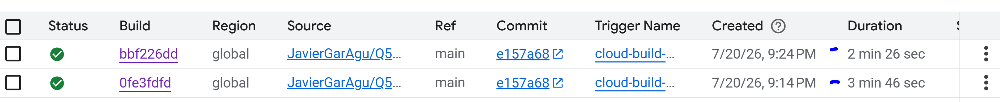

BEFORE AND AFTER CACHE IS APPLIED



# Q56 - Optimizing Cloud Build Performance Using Cloud Storage Cache

## Question

You use Cloud Build to build your application. You want to reduce the build time while minimizing cost and development effort.

What should you do?

A. Use Cloud Storage to cache intermediate artifacts.  
B. Run multiple Jenkins agents to parallelize the build.  
C. Use multiple smaller build steps to minimize execution time.  
D. Use larger Cloud Build virtual machines (VMs) by using the machine-type option.

## Correct Answer

**A - Use Cloud Storage to cache intermediate artifacts.**

## Explanation

Cloud Build allows applications to be built using automated pipelines. During the build process, many projects download the same dependencies or generate intermediate files repeatedly.

Instead of increasing the machine size or adding more build workers, a better solution is storing reusable artifacts in Cloud Storage.

With Cloud Storage caching:

- The first build downloads and stores the required dependencies.
- Future builds restore the cached artifacts.
- Build time is reduced.
- Infrastructure cost remains low.
- The development workflow does not need major changes.

Option D can improve performance by using more powerful machines, but it increases cost and does not optimize repeated work. The recommended solution is caching intermediate artifacts.

---

# Lab Architecture

This lab creates a Cloud Build pipeline that uses Cloud Storage as a cache layer.

The architecture contains:

```

GitHub Repository
|
|
v
Cloud Build Trigger
|
|
+----------------+
|                |
v                v
Cloud Storage Cache   Artifact Registry
|
|
Cached Dependencies

````

The pipeline:

1. Starts from a GitHub push.
2. Executes Cloud Build.
3. Checks if cached artifacts exist in Cloud Storage.
4. Downloads the cache if available.
5. Downloads the dependency only when the cache is missing.
6. Updates the cache.
7. Builds and pushes the container image to Artifact Registry.

---

# Terraform Configuration

## Enabled APIs

Terraform enables the required Google Cloud services:

- Cloud Build API
- Artifact Registry API

```hcl
resource "google_project_service" "cloudbuild" {

  service = "cloudbuild.googleapis.com"

}

resource "google_project_service" "artifactregistry" {

  service = "artifactregistry.googleapis.com"

}
````

These APIs are required to create the pipeline and store container images.

---

# Artifact Registry

The container images generated by Cloud Build are stored in Artifact Registry.

```hcl
resource "google_artifact_registry_repository" "repository" {

  repository_id = "secure-images"

  location = "europe-west1"

  format = "DOCKER"

}
```

The repository stores the final Docker image created by the pipeline.

---

# Cloud Storage Cache Bucket

Terraform creates a dedicated bucket for cached build artifacts.

```hcl
resource "google_storage_bucket" "cache_bucket" {

  name = "cloud-build-cache-xxxx"

  location = "EU"

}
```

This bucket stores reusable files between builds.

Example:

```
gs://cloud-build-cache-xxxx/ubuntu-cloud.img
```

---

# Cloud Build Service Account

A custom service account is used by Cloud Build.

```hcl
resource "google_service_account" "cloudbuild_sa" {

  account_id = "container-cache-cloudbuild"

}
```

The account receives the required permissions.

---

# IAM Permissions

## Logging Permission

Allows Cloud Build to write logs.

```hcl
role = "roles/logging.logWriter"
```

## Artifact Registry Permission

Allows pushing images.

```hcl
role = "roles/artifactregistry.writer"
```

## Cloud Storage Permission

Allows reading and writing cached files.

```hcl
role = "roles/storage.objectAdmin"
```

---

# Cloud Build Trigger

The trigger connects GitHub with Cloud Build.

```hcl
resource "google_cloudbuild_trigger" "cache_pipeline" {

  name = "cloud-build-cache-pipeline"

  filename = "cloudbuild.yaml"

}
```

The trigger starts automatically when code is pushed to the main branch.

Terraform also passes the bucket name as a substitution variable:

```hcl
substitutions = {

  _CACHE_BUCKET = google_storage_bucket.cache_bucket.name

}
```

This avoids hardcoding infrastructure values inside the pipeline.

---

# Cloud Build Configuration

The pipeline is defined in `cloudbuild.yaml`.

## Restore Cache

The first step checks Cloud Storage.

```yaml
gsutil cp gs://$_CACHE_BUCKET/ubuntu-cloud.img /workspace/cache/
```

If the file exists, the pipeline restores it.

---

## Download Dependency

If the cache does not exist, the dependency is downloaded.

```bash
wget -O ubuntu-cloud.img \
https://cloud-images.ubuntu.com/releases/24.04/release/ubuntu-24.04-server-cloudimg-amd64.img
```

This simulates a large dependency download.

---

## Update Cache

After the build preparation, the artifact is uploaded again.

```bash
gsutil cp ubuntu-cloud.img gs://$_CACHE_BUCKET/ubuntu-cloud.img
```

Future builds can reuse this file.

---

## Build Container Image

Cloud Build creates the Docker image.

```yaml
- name: 'gcr.io/cloud-builders/docker'

  args:

  - build

  - -t

  - europe-west1-docker.pkg.dev/$PROJECT_ID/$_REPOSITORY/$_IMAGE:latest

```

---

## Push Image

The image is uploaded to Artifact Registry.

```yaml
- name: 'gcr.io/cloud-builders/docker'

  args:

  - push

  - europe-west1-docker.pkg.dev/$PROJECT_ID/$_REPOSITORY/$_IMAGE:latest

```

---

# Testing

## First Build

The first execution should show:

```
No cache available.
Downloading large dependency...
Uploading artifact to Cloud Storage cache...
```

The build downloads the dependency because the cache is empty.

---

## Second Build

The next execution should show:

```
Cache found. Restoring artifact...
Using cached dependency.
```

The dependency download step is skipped.

The build finishes faster because Cloud Storage provides the cached artifact.

---

# Verification Commands

List Artifact Registry images:

```powershell
gcloud artifacts docker images list `
europe-west1-docker.pkg.dev/devops-cert-labs-v2/secure-images
```

List cache bucket:

```powershell
gsutil ls gs://$(terraform output -raw cache_bucket)
```

List Cloud Build triggers:

```powershell
gcloud builds triggers list
```

---

# Conclusion

This lab demonstrates how Cloud Storage can be used as a cache system for Cloud Build pipelines.

Using cached intermediate artifacts:

* Reduces build execution time.
* Avoids unnecessary downloads.
* Minimizes infrastructure cost.
* Requires minimal development changes.

This matches the recommended Google Cloud solution: **use Cloud Storage to cache intermediate artifacts.**

