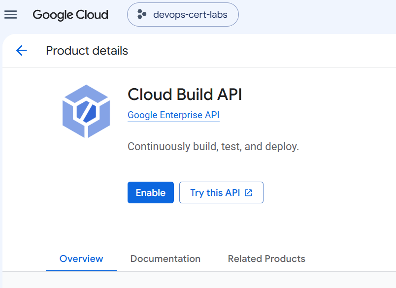
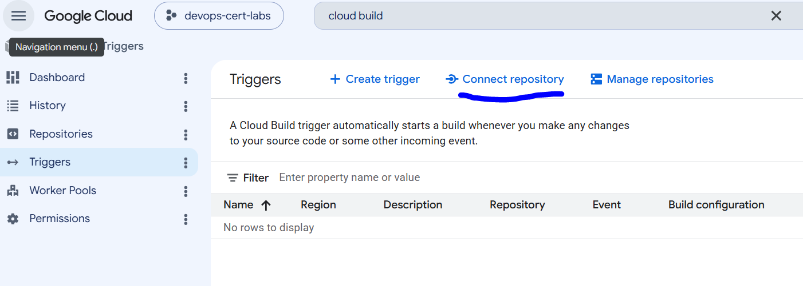
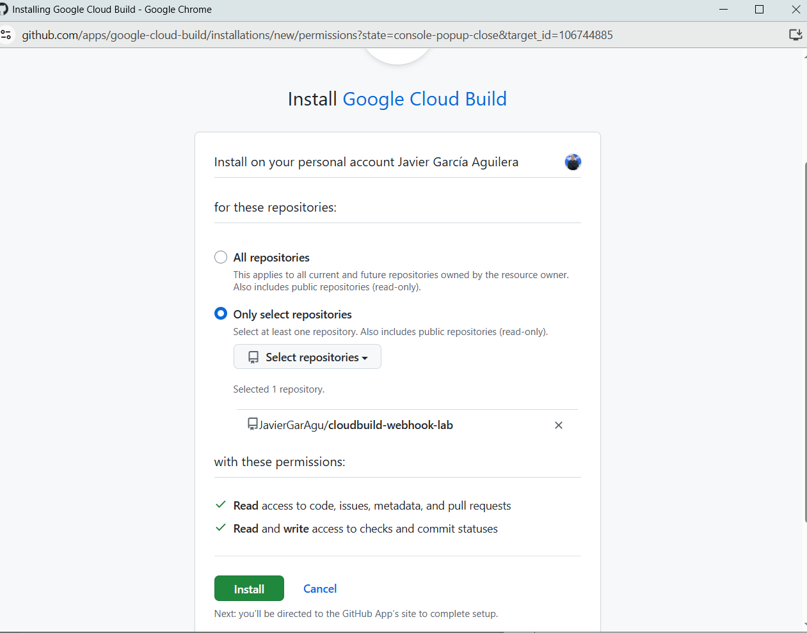
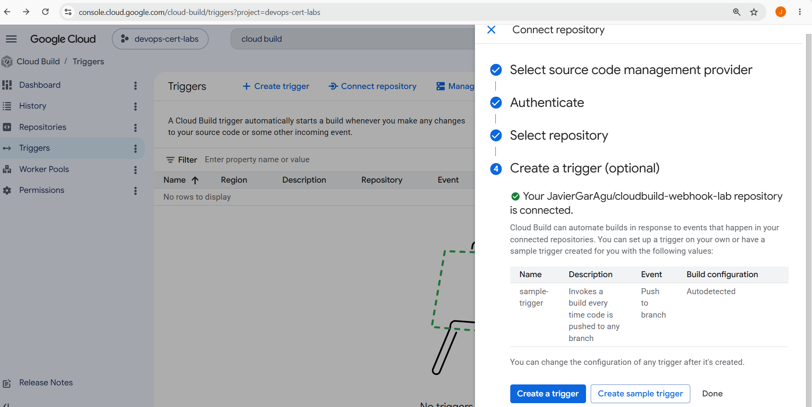
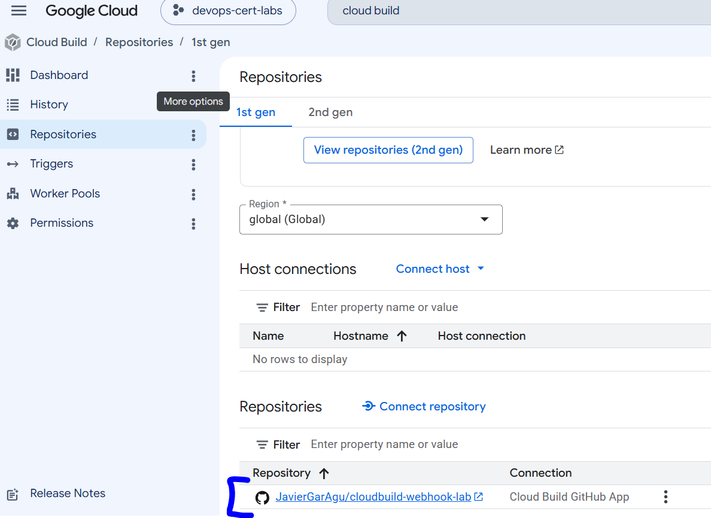
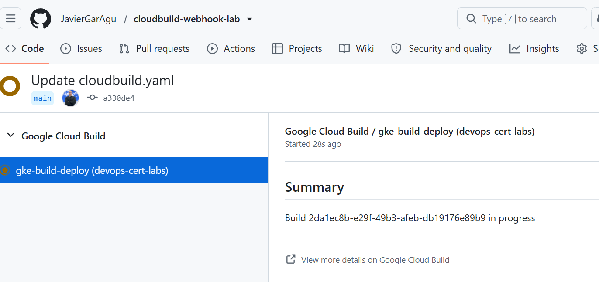
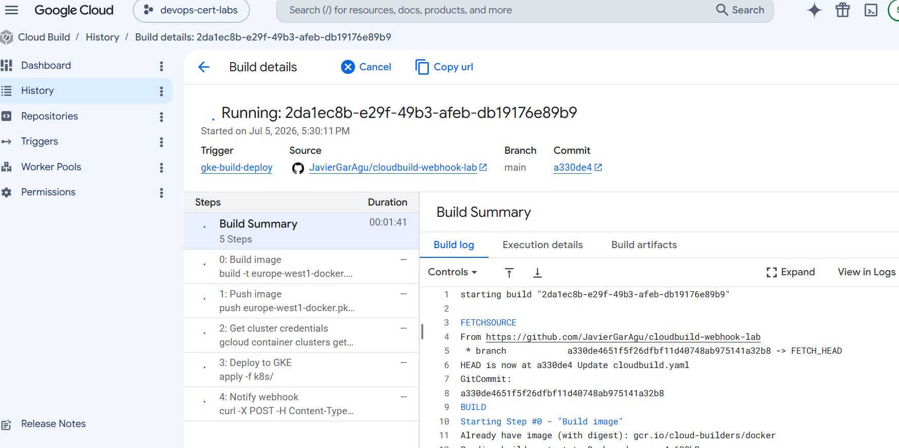
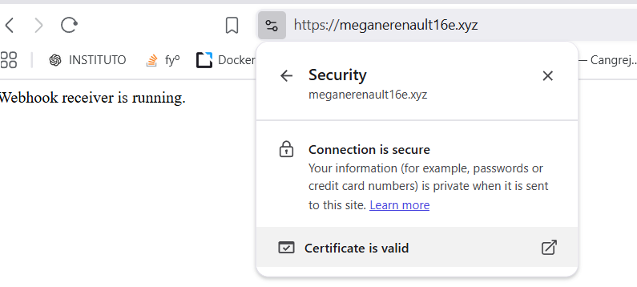

create repo JavierGarAgu/cloudbuild-webhook-lab

https://console.cloud.google.com/cloud-build/triggers?project=devops-cert-labs

for now is implemented with B response, but is not the correct

gcloud container clusters get-credentials cloudbuild-webhook-lab --zone=europe-west1-b --project=devops-cert-labs

añadir artifact reader

gcloud projects add-iam-policy-binding devops-cert-labs `
  --member="serviceAccount:gke-node-sa@devops-cert-labs.iam.gserviceaccount.com" `
  --role="roles/artifactregistry.reader"

PENDIENTE COMPROBAR WEBHOOK 1.0.0

 kubectl get ingress -n production

Añadir a godaddy registro A + @ + ip ingress

 nslookup meganerenault16e.xyz

 PS C:\Users\javier\Desktop\devopsv2\GCP-Professional-Cloud-DevOps-Engineer\labs\Q6> kubectl get ingress -n production
NAME              CLASS    HOSTS                  ADDRESS          PORTS   AGE
webhook-ingress   <none>   meganerenault16e.xyz   136.68.165.184   80      14m
PS C:\Users\javier\Desktop\devopsv2\GCP-Professional-Cloud-DevOps-Engineer\labs\Q6> nslookup meganerenault16e.xyz
Server:  UnKnown
Address:  100.90.1.1

Non-authoritative answer:
Name:    meganerenault16e.xyz
Addresses:  136.68.165.184
          13.248.243.5
          76.223.105.230

 kubectl describe managedcertificate webhook-cert -n production

curl.exe -H "Host: meganerenault16e.xyz" http://136.68.165.184/
Webhook receiver is running.

gcloud pubsub subscriptions create cloud-builds-webhook `
    --topic=cloud-builds `
    --push-endpoint=https://meganerenault16e.xyz `
    --ack-deadline=30

# Cloud Build -> Pub/Sub -> HTTP Webhook (Exam Option D)

# ==========================================================

# 1. Verify that the Cloud Build Pub/Sub topic exists

# ==========================================================

gcloud pubsub topics list

# Lists all Pub/Sub topics.

# ==========================================================

# 2. Create a Push Subscription

# ==========================================================

gcloud pubsub subscriptions create cloud-builds-webhook ^
--topic=cloud-builds ^
--push-endpoint=https://meganerenault16e.xyz ^
--ack-deadline=30

# Creates a Push Subscription that automatically HTTP POSTs

# every Cloud Build event to the webhook.

# ==========================================================

# 3. Verify the subscription

# ==========================================================

gcloud pubsub subscriptions describe cloud-builds-webhook

# Shows the Push endpoint and subscription configuration.

# ==========================================================

# 4. Create a minimal Cloud Build config

# ==========================================================

# cloudbuild.yaml

steps:

* name: gcr.io/cloud-builders/gcloud
  args: ["version"]

# Smallest possible build.

# Only executes "gcloud version".

# ==========================================================

# 5. Launch the build

# ==========================================================

gcloud builds submit --no-source --config=cloudbuild.yaml

# Starts a Cloud Build.

# Cloud Build publishes the build event into the cloud-builds topic.

# ==========================================================

# 6. Watch the webhook logs

# ==========================================================

kubectl logs -f deployment/webhook -n production

# Displays incoming POST requests received by the webhook.

# ==========================================================

# 7. Verify the webhook manually

# ==========================================================

curl.exe -H "Host: meganerenault16e.xyz" http://136.68.165.184/

# Tests the Ingress using the Host header.

# ==========================================================

# 8. Verify DNS

# ==========================================================

nslookup meganerenault16e.xyz

# Confirms the domain resolves to the Ingress IP.

# ==========================================================

# 9. Verify Ingress

# ==========================================================

kubectl get ingress -n production

# Shows the external IP assigned to the Ingress.

kubectl describe ingress webhook-ingress -n production

# Shows routing rules and backend health.

# ==========================================================

# 10. Verify Managed Certificate

# ==========================================================

kubectl get managedcertificate -n production

# Shows certificate status.

kubectl describe managedcertificate webhook-cert -n production

# Displays certificate provisioning progress.

# ==========================================================

# 11. Verify Service

# ==========================================================

kubectl get svc -n production

# Lists Services.

kubectl get svc webhook -n production -o yaml

# Displays the Service configuration.

# ==========================================================

# 12. Verify Endpoints

# ==========================================================

kubectl get endpoints webhook -n production

# Confirms the Service points to the running Pod.

# ==========================================================

# 13. Verify Pods

# ==========================================================

kubectl get pods -n production

# Lists Pods.

kubectl describe pod <pod-name> -n production

# Shows scheduling and container events.

kubectl logs <pod-name> -n production

# Displays application logs.

# ==========================================================

# 14. Architecture (Exam Answer D)

# ==========================================================

Cloud Build
│
▼
cloud-builds (Pub/Sub Topic)
│
▼
Push Subscription
│
▼
HTTP POST
│
▼
Webhook (GKE)

Exam answer:
D. Create a Cloud Pub/Sub push subscription to the Cloud Build cloud-builds Pub/Sub topic to HTTP POST the build information to a webhook.

Reason:

* No changes to cloudbuild.yaml
* No curl step
* No custom code
* Pub/Sub automatically delivers build events to the webhook
* Minimum development effort

Cloud Build produce el evento. Pub/Sub lo distribuye. La Push Subscription convierte ese evento en un HTTP POST hacia el webhook.