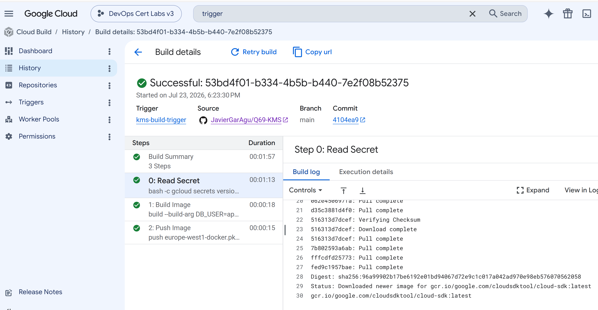

COMMANDS
```
gcloud secrets versions access latest --secret=database-password

#test1234
```

CORRECT PIPELINE SIGN



# Q69 - Cloud Build, Cloud KMS and Secret Manager

## Overview

This lab demonstrates how to build a secure CI/CD pipeline on Google Cloud by combining Cloud Build, Cloud KMS, Secret Manager and Artifact Registry.

The objective is to protect sensitive information such as database credentials without storing them inside the source code or the GitHub repository. During the build process, Cloud Build securely retrieves the secret from Secret Manager and then builds and pushes a Docker image to Artifact Registry.

This architecture follows Google Cloud security best practices and represents a common production scenario.

---

# Architecture

The infrastructure created by Terraform includes the following resources:

* Required Google Cloud APIs
* Dedicated Cloud Build Service Account
* IAM roles for Cloud Build
* Cloud KMS Key Ring
* Cloud KMS Crypto Key
* Secret Manager Secret
* Secret Version
* Artifact Registry Docker repository
* Cloud Storage bucket for build logs
* Cloud Build Trigger connected to GitHub

The deployment flow is:

GitHub Repository

↓

Cloud Build Trigger

↓

Cloud Build

↓

Secret Manager

↓

Cloud KMS

↓

Docker Image Build

↓

Artifact Registry

---

# Terraform Infrastructure

The `main.tf` file provisions all the required resources for the lab.

## Project configuration

Terraform configures the Google provider and enables every API required by Cloud Build, Cloud KMS, Secret Manager, Artifact Registry and IAM.

Enabling APIs automatically makes the project ready before any other resource is created.

---

## Service Account

A dedicated Service Account is created for Cloud Build.

Instead of using broad project permissions, the Service Account receives only the permissions required to execute the build pipeline.

The assigned IAM roles include:

* Artifact Registry Writer
* Secret Manager Secret Accessor
* Cloud KMS CryptoKey Encrypter/Decrypter
* Storage Admin
* Logging Writer

This follows the Principle of Least Privilege.

---

## Cloud KMS

Terraform creates a Key Ring and a Crypto Key.

Cloud KMS is Google's managed encryption service that allows applications and services to encrypt sensitive information using centrally managed encryption keys.

Using Cloud KMS avoids managing encryption keys manually and simplifies secure deployments.

---

## Secret Manager

A Secret Manager secret stores the application's database password.

Instead of committing secrets to GitHub, the application retrieves them securely during the build process.

This reduces the risk of exposing sensitive information inside source code repositories.

---

## Artifact Registry

Artifact Registry stores the Docker image generated by Cloud Build.

After the build completes successfully, the image is pushed to the repository and becomes available for deployment.

---

## Cloud Build Trigger

Terraform creates a GitHub trigger connected to the repository.

Every push to the **main** branch automatically starts a Cloud Build pipeline.

The pipeline performs three main tasks:

1. Read the database secret.
2. Build the Docker image.
3. Push the image to Artifact Registry.

This provides a fully automated CI/CD workflow.

---

# Cloud Build Pipeline

The `cloudbuild.yaml` file contains the build process.

The pipeline first retrieves the latest version of the database password from Secret Manager.

Next, Docker builds the application image using the provided build arguments.

Finally, the image is uploaded to Artifact Registry.

If every step finishes successfully, the build status changes to **SUCCESS** and the Docker image becomes available in Artifact Registry.

---

# Security Benefits

This solution improves security in several ways:

* Secrets are never stored in the GitHub repository.
* Cloud Build accesses secrets only during execution.
* Encryption keys are managed by Cloud KMS.
* IAM restricts access to authorized identities.
* Docker images are stored securely in Artifact Registry.

This approach minimizes operational effort while protecting sensitive application data.

---

# Exam Question

**Question**

You use Cloud Build to build and deploy your application. You want to securely incorporate database credentials and other application secrets into the build pipeline. You also want to minimize the development effort.

**Correct Answer**

**D — Use Cloud Key Management Service (Cloud KMS) to encrypt the secrets and include them in your Cloud Build deployment configuration. Grant Cloud Build access to the KeyRing.**

---

# Why Option D is Correct

Cloud KMS is Google's managed encryption service and integrates directly with Cloud Build and Secret Manager.

The development team does not need to implement custom encryption or manage encryption keys manually.

Cloud Build can securely retrieve encrypted secrets while IAM controls access to the encryption keys.

This solution provides strong security with minimal development effort.

---

# Why the Other Answers Are Incorrect

### A

A Cloud Storage bucket only provides encryption at rest managed by Google.

It is not designed for secret management and does not provide fine-grained secret access or versioning.

---

### B

Encrypting secrets manually and storing decryption keys in another repository increases operational complexity.

Developers become responsible for key management, which is exactly what Cloud KMS is designed to avoid.

---

### C

Client-side encryption requires the application or developers to perform encryption and decryption themselves.

In addition, storing the decryption key inside the same bucket removes most of the security benefits.

This approach requires significantly more development effort than using Cloud KMS.

---

# Conclusion

This lab demonstrates a secure Google Cloud CI/CD pipeline where Cloud Build retrieves secrets from Secret Manager, encryption keys are managed by Cloud KMS and Docker images are published to Artifact Registry.

The design follows Google Cloud security best practices and closely matches the type of secure deployment architecture frequently tested in the Professional Cloud DevOps Engineer certification exam.
