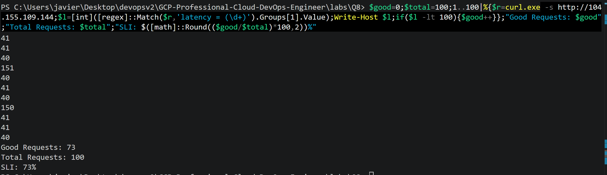

LAB COMMANDS
```
gcloud container clusters get-credentials sli-lab --zone europe-west1-b

kubectl get nodes

kubectl get pods -A

kubectl get pods -n production

kubectl get svc -n production

kubectl get deployments -n production

kubectl get configmap -n production

kubectl describe svc nginx -n production

kubectl describe pod -n production -l app=homepage

kubectl logs deployment/homepage -n production

kubectl logs deployment/nginx -n production

kubectl exec -it deployment/nginx -n production -- sh

wget -qO- http://homepage:3000

exit

curl http://IP

curl http://IP

curl http://IP

$good=0;$total=100;1..100|%{$l=[int]((curl.exe -s http://104.155.109.144) -replace '\D','');if($l -lt 100){$good++}};"Good Requests: $good";"Total Requests: $total";"SLI: $([math]::Round(($good/$total)*100,2))%"
```


Google recommends a request-based SLI for latency objectives. Instead of using percentiles, you classify each homepage request as either good or bad. A request is considered good if it completes in less than 100 ms. The SLI is then calculated by dividing the number of good requests by the total number of homepage requests. This directly measures the percentage of users experiencing acceptable performance and aligns with Google's SRE best practices.

Formula:

SLI = Requests with latency < 100 ms
      --------------------------------
      Total homepage requests

This is exactly what the lab simulates.


