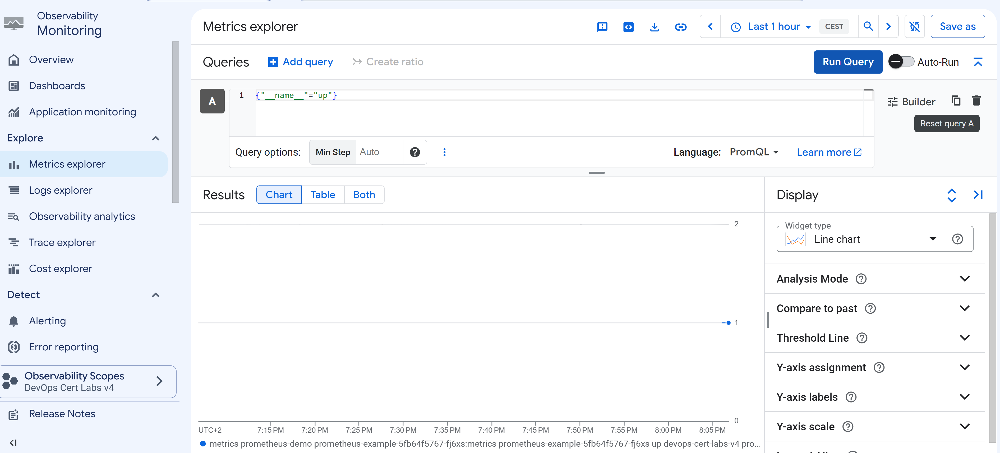

COMMANDS
```
gcloud container clusters get-credentials prometheus-demo --region europe-west1-b

gcloud container clusters update prometheus-demo `
  --zone europe-west1-b `
  --enable-managed-prometheus

kubectl get pods -n gmp-system

kubectl create namespace prometheus-demo

kubectl apply -f app.yaml
kubectl apply -f podmonitoring.yaml

kubectl get pods -n prometheus-demo
kubectl get podmonitoring -n prometheus-demo
```

RESULT



# Google Cloud Managed Service for Prometheus with GKE

## Overview

This project demonstrates how to configure Google Cloud Managed Service for Prometheus with a Google Kubernetes Engine (GKE) cluster.

The goal of this laboratory is to understand how Google provides a managed Prometheus monitoring solution for Kubernetes workloads without requiring engineers to maintain their own Prometheus infrastructure.

This setup represents a common production environment:

- A GKE cluster running applications.
- Applications exposing Prometheus metrics.
- Managed Prometheus collecting metrics.
- Cloud Monitoring storing and querying metrics using PromQL.

---

## Architecture

```
                    Google Cloud Monitoring
                             |
                             |
        Google Cloud Managed Service for Prometheus
                             |
                             |
                      GMP Collector
                             |
                             |
                    PodMonitoring Resource
                             |
                             |
                    Kubernetes Application
                             |
                             |
                         GKE Cluster
```

---

## Technologies Used

- Google Kubernetes Engine (GKE)
- Google Cloud Managed Service for Prometheus
- Cloud Monitoring
- Terraform
- Kubernetes
- PromQL

---

# Infrastructure Deployment

The infrastructure is deployed using Terraform.

Terraform creates:

- Required Google Cloud APIs.
- A GKE Standard cluster.
- A Kubernetes node pool.
- Workload Identity configuration.
- Managed Prometheus integration.

---

# GKE Cluster Configuration

The cluster uses GKE Standard instead of GKE Autopilot.

The reason is to have more control over Kubernetes resources and understand how the platform works internally.

Cluster configuration:

- GKE Standard cluster.
- One node pool.
- One e2-standard-2 worker node.
- Workload Identity enabled.
- Managed Prometheus enabled.

---

# Google Cloud Managed Service for Prometheus

Google Cloud Managed Service for Prometheus is a fully managed monitoring solution compatible with Prometheus.

It allows Kubernetes workloads to expose Prometheus metrics while Google manages the monitoring backend.

With a traditional Prometheus installation, engineers need to manage:

- Prometheus servers.
- Storage.
- Scaling.
- High availability.
- Federation between clusters.

Managed Prometheus reduces this operational overhead.

---

# Managed Prometheus Components

After enabling Managed Prometheus, GKE automatically deploys the required components.

Example:

```
gmp-system

collector          Running
gmp-operator       Running
```

## GMP Operator

The GMP Operator manages Prometheus-related Kubernetes resources.

Responsibilities:

- Managing monitoring configurations.
- Managing collectors.
- Applying Prometheus rules.

---

## GMP Collector

The collector is responsible for:

- Discovering Kubernetes workloads.
- Scraping Prometheus metrics.
- Sending metrics to Google Cloud Monitoring.

---

# Application Metrics

The Kubernetes application exposes metrics using the Prometheus format.

Prometheus applications normally expose metrics through:

```
/metrics
```

Example:

```
http_requests_total 150
application_status 1
```

The GMP collector collects these metrics and sends them to Cloud Monitoring.

---

# PodMonitoring Resource

Managed Prometheus uses Kubernetes custom resources to define which workloads must be monitored.

Example:

```yaml
apiVersion: monitoring.googleapis.com/v1
kind: PodMonitoring
```

A PodMonitoring resource defines:

- Which pods are monitored.
- Which port contains metrics.
- How frequently metrics are collected.

Example:

```yaml
endpoints:
- port: metrics
  interval: 30s
```

This configuration collects metrics every 30 seconds.

---

# Validation

## Check Kubernetes Nodes

```bash
kubectl get nodes
```

Expected result:

```
NAME                     STATUS
gke-node-name            Ready
```

---

## Check Managed Prometheus Components

```bash
kubectl get pods -A | grep gmp
```

Expected result:

```
gmp-system     collector        Running
gmp-system     gmp-operator     Running
```

---

## Check Monitoring Resources

```bash
kubectl get podmonitoring -A
```

Expected result:

```
NAME
prometheus-example
```

---

# Query Metrics Using PromQL

Metrics can be queried from Google Cloud Console:

```
Monitoring
    |
Metrics Explorer
    |
PromQL
```

Example query:

```promql
up
```

This query shows active monitored targets.

Another example:

```promql
go_gc_duration_seconds
```

This returns application runtime metrics.

---

# Why Managed Prometheus?

Managed Prometheus is recommended for environments with multiple Kubernetes clusters because it provides:

- Centralized metric storage.
- Global metric queries.
- PromQL support.
- Integration with Cloud Monitoring.
- Lower operational complexity.

---

# Comparison with Prometheus Federation

## Prometheus Federation

Prometheus Federation allows one Prometheus server to collect metrics from other Prometheus servers.

Advantages:

- Native Prometheus feature.
- Full control over the architecture.

Disadvantages:

- More infrastructure to manage.
- More maintenance.
- Higher operational complexity.

---

## Hierarchical Federation

Example:

```
Prometheus Cluster 1
          |
Prometheus Cluster 2
          |
    Global Prometheus
```

This approach works but requires managing multiple Prometheus servers.

---

## Google Cloud Managed Service for Prometheus

Example:

```
GKE Cluster Europe
        |
        |
 GMP Collector
        |
        |
 Cloud Monitoring


GKE Cluster USA
        |
        |
 GMP Collector
```

Advantages:

- Global visibility across clusters.
- Google manages the backend.
- Less operational work.

---

# Certification Exam Explanation

For the Google Professional Cloud DevOps Engineer certification:

If a question mentions:

- Multiple GKE clusters.
- Global Prometheus queries.
- Minimal management overhead.

The correct answer is:

```
Google Cloud Managed Service for Prometheus
```

The reason is that Google provides a scalable managed solution instead of requiring engineers to maintain Prometheus federation.

---

# Cleanup

Remove all created resources:

```bash
terraform destroy
```

This deletes:

- GKE cluster.
- Node pool.
- Cloud resources.

---

# Key Learnings

After completing this laboratory, you should understand:

- How Managed Prometheus works with GKE.
- How Kubernetes applications expose metrics.
- How PodMonitoring resources work.
- How PromQL is used to query metrics.
- Why Managed Prometheus is recommended for large Kubernetes environments.